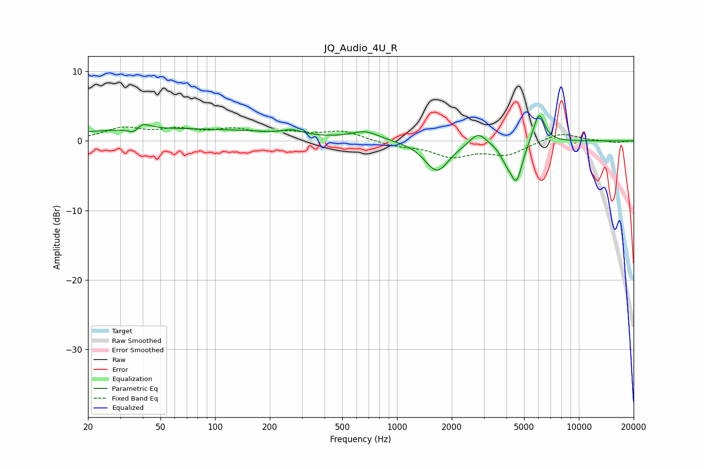

# JQ_Audio_4U_R
See [usage instructions](https://github.com/jaakkopasanen/AutoEq#usage) for more options and info.

### Parametric EQs
Apply preamp of -3.7 dB when using parametric equalizer.

|   # | Type    |   Fc (Hz) |    Q |   Gain (dB) |
|-----|---------|-----------|------|-------------|
|   1 | Peaking |        36 | 4.01 |        -1.8 |
|   2 | Peaking |        38 | 3.37 |         1.9 |
|   3 | Peaking |        59 | 0.22 |         1.7 |
|   4 | Peaking |       267 | 2.96 |         0.6 |
|   5 | Peaking |       670 | 1.86 |         1.3 |
|   6 | Peaking |      1660 | 2.11 |        -4.4 |
|   7 | Peaking |      2790 | 3.22 |         1.8 |
|   8 | Peaking |      3981 | 4.34 |        -1.5 |
|   9 | Peaking |      4535 | 4.1  |        -5.5 |
|  10 | Peaking |      6031 | 4.31 |         4.5 |

### Fixed Band EQs
When using fixed band (also called graphic) equalizer, apply preamp of **-2.1 dB** (if available) and set gains manually with these parameters.

|   # | Type    |   Fc (Hz) |    Q |   Gain (dB) |
|-----|---------|-----------|------|-------------|
|   1 | Peaking |        31 | 1.41 |         1.7 |
|   2 | Peaking |        62 | 1.41 |         1.3 |
|   3 | Peaking |       125 | 1.41 |         1.4 |
|   4 | Peaking |       250 | 1.41 |         1   |
|   5 | Peaking |       500 | 1.41 |         1.3 |
|   6 | Peaking |      1000 | 1.41 |        -0.7 |
|   7 | Peaking |      2000 | 1.41 |        -2.1 |
|   8 | Peaking |      4000 | 1.41 |        -1.9 |
|   9 | Peaking |      8000 | 1.41 |         1.2 |
|  10 | Peaking |     16000 | 1.41 |        -0.2 |

### Graphs

