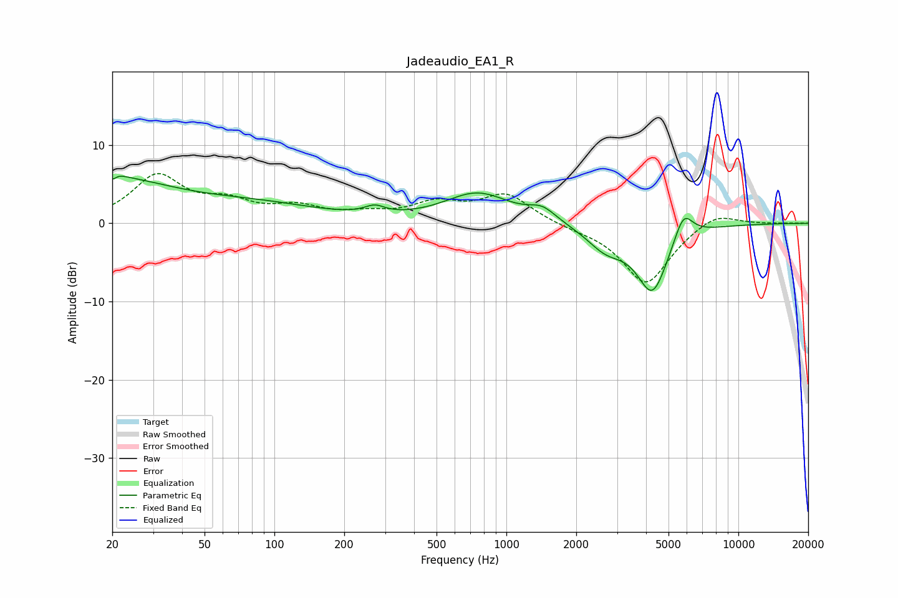

# Jadeaudio_EA1_R
See [usage instructions](https://github.com/jaakkopasanen/AutoEq#usage) for more options and info.

### Parametric EQs
Apply preamp of -6.1 dB when using parametric equalizer.

|   # | Type    |   Fc (Hz) |    Q |   Gain (dB) |
|-----|---------|-----------|------|-------------|
|   1 | Peaking |        20 | 4.92 |         3.9 |
|   2 | Peaking |        20 | 0.53 |         5.2 |
|   3 | Peaking |        20 | 5.91 |        -3.9 |
|   4 | Peaking |        86 | 0.5  |         2   |
|   5 | Peaking |       271 | 3.27 |         1   |
|   6 | Peaking |       752 | 1    |         3.8 |
|   7 | Peaking |      1429 | 2.43 |         1.5 |
|   8 | Peaking |      2680 | 1.69 |        -2.8 |
|   9 | Peaking |      4262 | 2.01 |        -8.6 |
|  10 | Peaking |      5797 | 3.39 |         3.7 |

### Fixed Band EQs
When using fixed band (also called graphic) equalizer, apply preamp of **-6.5 dB** (if available) and set gains manually with these parameters.

|   # | Type    |   Fc (Hz) |    Q |   Gain (dB) |
|-----|---------|-----------|------|-------------|
|   1 | Peaking |        31 | 1.41 |         5.9 |
|   2 | Peaking |        62 | 1.41 |         2.2 |
|   3 | Peaking |       125 | 1.41 |         1.8 |
|   4 | Peaking |       250 | 1.41 |         0.9 |
|   5 | Peaking |       500 | 1.41 |         2.3 |
|   6 | Peaking |      1000 | 1.41 |         3.6 |
|   7 | Peaking |      2000 | 1.41 |        -0.4 |
|   8 | Peaking |      4000 | 1.41 |        -7.8 |
|   9 | Peaking |      8000 | 1.41 |         1.7 |
|  10 | Peaking |     16000 | 1.41 |         0   |

### Graphs

