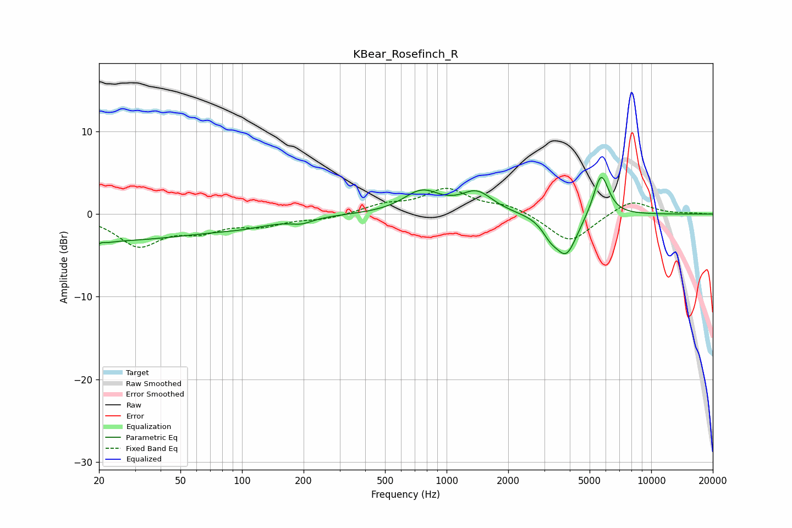

# KBear_Rosefinch_R
See [usage instructions](https://github.com/jaakkopasanen/AutoEq#usage) for more options and info.

### Parametric EQs
Apply preamp of -4.5 dB when using parametric equalizer.

|   # | Type    |   Fc (Hz) |    Q |   Gain (dB) |
|-----|---------|-----------|------|-------------|
|   1 | Peaking |        20 | 5.11 |        -3   |
|   2 | Peaking |        20 | 5.94 |         2.6 |
|   3 | Peaking |        22 | 0.27 |        -3.1 |
|   4 | Peaking |       102 | 1    |        -0.6 |
|   5 | Peaking |       196 | 2.68 |        -0.6 |
|   6 | Peaking |       755 | 1.6  |         2.6 |
|   7 | Peaking |      1405 | 1.83 |         2.5 |
|   8 | Peaking |      3209 | 3.62 |        -1.4 |
|   9 | Peaking |      3848 | 2.55 |        -4.9 |
|  10 | Peaking |      5688 | 3.64 |         5.3 |

### Fixed Band EQs
When using fixed band (also called graphic) equalizer, apply preamp of **-3.2 dB** (if available) and set gains manually with these parameters.

|   # | Type    |   Fc (Hz) |    Q |   Gain (dB) |
|-----|---------|-----------|------|-------------|
|   1 | Peaking |        31 | 1.41 |        -3.7 |
|   2 | Peaking |        62 | 1.41 |        -1.7 |
|   3 | Peaking |       125 | 1.41 |        -1.2 |
|   4 | Peaking |       250 | 1.41 |        -0.6 |
|   5 | Peaking |       500 | 1.41 |         1   |
|   6 | Peaking |      1000 | 1.41 |         2.9 |
|   7 | Peaking |      2000 | 1.41 |         1   |
|   8 | Peaking |      4000 | 1.41 |        -3.5 |
|   9 | Peaking |      8000 | 1.41 |         1.8 |
|  10 | Peaking |     16000 | 1.41 |         0.1 |

### Graphs

