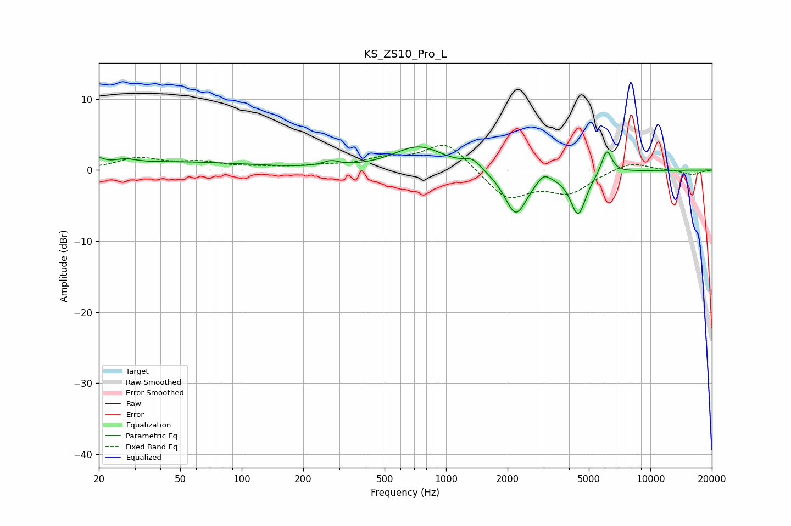

# KS_ZS10_Pro_L
See [usage instructions](https://github.com/jaakkopasanen/AutoEq#usage) for more options and info.

### Parametric EQs
Apply preamp of -3.4 dB when using parametric equalizer.

|   # | Type    |   Fc (Hz) |    Q |   Gain (dB) |
|-----|---------|-----------|------|-------------|
|   1 | Peaking |        20 | 5.18 |         0.9 |
|   2 | Peaking |        27 | 2.56 |         0.7 |
|   3 | Peaking |        50 | 0.4  |         1.1 |
|   4 | Peaking |       274 | 3.53 |         0.7 |
|   5 | Peaking |       737 | 1.14 |         3.3 |
|   6 | Peaking |      1345 | 3.37 |         1.3 |
|   7 | Peaking |      2196 | 2.52 |        -6.3 |
|   8 | Peaking |      3007 | 4.64 |         1.2 |
|   9 | Peaking |      4432 | 3.64 |        -6.1 |
|  10 | Peaking |      6117 | 5.52 |         3.5 |

### Fixed Band EQs
When using fixed band (also called graphic) equalizer, apply preamp of **-3.6 dB** (if available) and set gains manually with these parameters.

|   # | Type    |   Fc (Hz) |    Q |   Gain (dB) |
|-----|---------|-----------|------|-------------|
|   1 | Peaking |        31 | 1.41 |         1.6 |
|   2 | Peaking |        62 | 1.41 |         1   |
|   3 | Peaking |       125 | 1.41 |         0.3 |
|   4 | Peaking |       250 | 1.41 |         0.5 |
|   5 | Peaking |       500 | 1.41 |         1.3 |
|   6 | Peaking |      1000 | 1.41 |         4   |
|   7 | Peaking |      2000 | 1.41 |        -4.1 |
|   8 | Peaking |      4000 | 1.41 |        -3   |
|   9 | Peaking |      8000 | 1.41 |         1.3 |
|  10 | Peaking |     16000 | 1.41 |        -0.6 |

### Graphs

