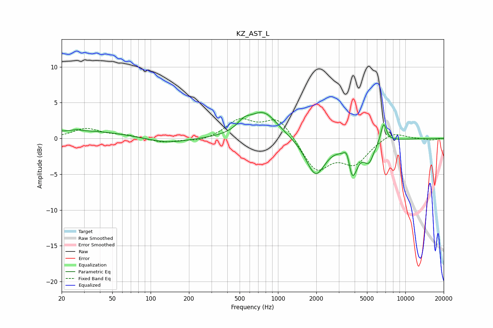

# KZ_AST_L
See [usage instructions](https://github.com/jaakkopasanen/AutoEq#usage) for more options and info.

### Parametric EQs
Apply preamp of -3.7 dB when using parametric equalizer.

|   # | Type    |   Fc (Hz) |    Q |   Gain (dB) |
|-----|---------|-----------|------|-------------|
|   1 | Peaking |        26 | 5.63 |         0.2 |
|   2 | Peaking |        27 | 0.38 |         1.1 |
|   3 | Peaking |       134 | 0.87 |        -0.8 |
|   4 | Peaking |       540 | 2.68 |         1.1 |
|   5 | Peaking |       769 | 1.25 |         3.7 |
|   6 | Peaking |      1972 | 1.86 |        -5.1 |
|   7 | Peaking |      3500 | 5.34 |         2.6 |
|   8 | Peaking |      3797 | 3.41 |        -5.5 |
|   9 | Peaking |      5170 | 3.44 |        -2.6 |
|  10 | Peaking |      6752 | 6    |         2.7 |

### Fixed Band EQs
When using fixed band (also called graphic) equalizer, apply preamp of **-2.9 dB** (if available) and set gains manually with these parameters.

|   # | Type    |   Fc (Hz) |    Q |   Gain (dB) |
|-----|---------|-----------|------|-------------|
|   1 | Peaking |        31 | 1.41 |         1.3 |
|   2 | Peaking |        62 | 1.41 |         0.4 |
|   3 | Peaking |       125 | 1.41 |        -0.6 |
|   4 | Peaking |       250 | 1.41 |        -0.5 |
|   5 | Peaking |       500 | 1.41 |         2.5 |
|   6 | Peaking |      1000 | 1.41 |         3   |
|   7 | Peaking |      2000 | 1.41 |        -4.5 |
|   8 | Peaking |      4000 | 1.41 |        -3.2 |
|   9 | Peaking |      8000 | 1.41 |         1.1 |
|  10 | Peaking |     16000 | 1.41 |        -0.2 |

### Graphs

