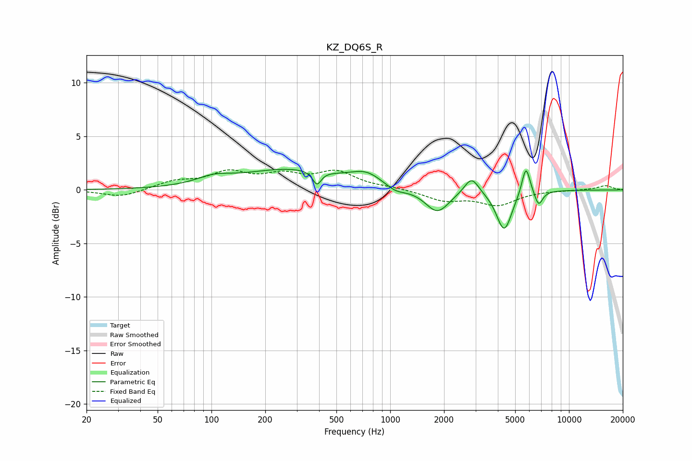

# KZ_DQ6S_R
See [usage instructions](https://github.com/jaakkopasanen/AutoEq#usage) for more options and info.

### Parametric EQs
Apply preamp of -2.0 dB when using parametric equalizer.

|   # | Type    |   Fc (Hz) |    Q |   Gain (dB) |
|-----|---------|-----------|------|-------------|
|   1 | Peaking |       103 | 1.48 |         0.7 |
|   2 | Peaking |       275 | 0.51 |         1.9 |
|   3 | Peaking |       389 | 6    |        -1.3 |
|   4 | Peaking |       735 | 1.62 |         1.1 |
|   5 | Peaking |      1071 | 2.51 |        -0.6 |
|   6 | Peaking |      1833 | 2.11 |        -2.2 |
|   7 | Peaking |      2851 | 3.5  |         1.6 |
|   8 | Peaking |      4340 | 3.26 |        -3.8 |
|   9 | Peaking |      5743 | 5.98 |         2.8 |
|  10 | Peaking |      6762 | 6    |        -1.4 |

### Fixed Band EQs
When using fixed band (also called graphic) equalizer, apply preamp of **-2.0 dB** (if available) and set gains manually with these parameters.

|   # | Type    |   Fc (Hz) |    Q |   Gain (dB) |
|-----|---------|-----------|------|-------------|
|   1 | Peaking |        31 | 1.41 |        -0.7 |
|   2 | Peaking |        62 | 1.41 |         0.7 |
|   3 | Peaking |       125 | 1.41 |         1.5 |
|   4 | Peaking |       250 | 1.41 |         1.2 |
|   5 | Peaking |       500 | 1.41 |         1.6 |
|   6 | Peaking |      1000 | 1.41 |         0.2 |
|   7 | Peaking |      2000 | 1.41 |        -0.9 |
|   8 | Peaking |      4000 | 1.41 |        -1.3 |
|   9 | Peaking |      8000 | 1.41 |        -0   |
|  10 | Peaking |     16000 | 1.41 |         0.4 |

### Graphs

