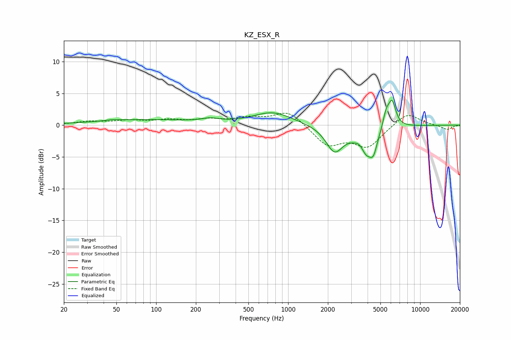

# KZ_ESX_R
See [usage instructions](https://github.com/jaakkopasanen/AutoEq#usage) for more options and info.

### Parametric EQs
Apply preamp of -4.0 dB when using parametric equalizer.

|   # | Type    |   Fc (Hz) |    Q |   Gain (dB) |
|-----|---------|-----------|------|-------------|
|   1 | Peaking |        46 | 3.13 |         0.1 |
|   2 | Peaking |        81 | 0.37 |         0.8 |
|   3 | Peaking |       257 | 2.2  |         0.5 |
|   4 | Peaking |       764 | 0.97 |         2   |
|   5 | Peaking |      2244 | 2.19 |        -3.9 |
|   6 | Peaking |      3528 | 3.93 |         1.4 |
|   7 | Peaking |      3892 | 2.14 |        -4.9 |
|   8 | Peaking |      4438 | 5.77 |        -1.9 |
|   9 | Peaking |      5521 | 5.5  |         2.3 |
|  10 | Peaking |      6126 | 4.72 |         4   |

### Fixed Band EQs
When using fixed band (also called graphic) equalizer, apply preamp of **-2.0 dB** (if available) and set gains manually with these parameters.

|   # | Type    |   Fc (Hz) |    Q |   Gain (dB) |
|-----|---------|-----------|------|-------------|
|   1 | Peaking |        31 | 1.41 |         0.5 |
|   2 | Peaking |        62 | 1.41 |         0.6 |
|   3 | Peaking |       125 | 1.41 |         0.7 |
|   4 | Peaking |       250 | 1.41 |         0.7 |
|   5 | Peaking |       500 | 1.41 |         1   |
|   6 | Peaking |      1000 | 1.41 |         2.3 |
|   7 | Peaking |      2000 | 1.41 |        -3.1 |
|   8 | Peaking |      4000 | 1.41 |        -3.3 |
|   9 | Peaking |      8000 | 1.41 |         2.1 |
|  10 | Peaking |     16000 | 1.41 |        -0.7 |

### Graphs

