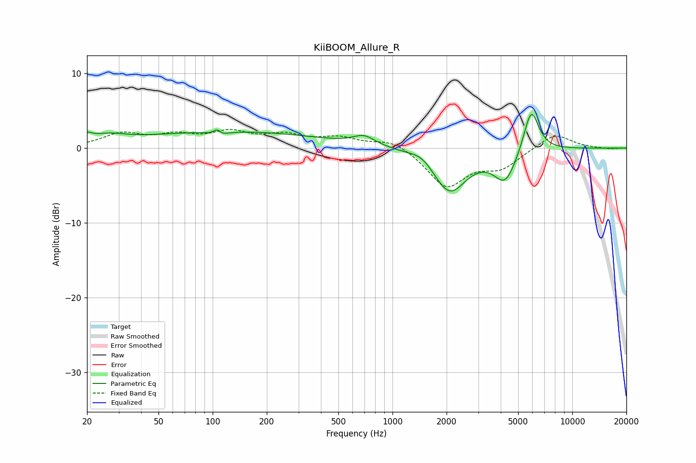

# KiiBOOM_Allure_R
See [usage instructions](https://github.com/jaakkopasanen/AutoEq#usage) for more options and info.

### Parametric EQs
Apply preamp of -4.6 dB when using parametric equalizer.

|   # | Type    |   Fc (Hz) |    Q |   Gain (dB) |
|-----|---------|-----------|------|-------------|
|   1 | Peaking |        20 | 5.06 |         0.8 |
|   2 | Peaking |        26 | 1.38 |         1.1 |
|   3 | Peaking |       106 | 5.61 |         2.1 |
|   4 | Peaking |       106 | 4.3  |        -1.9 |
|   5 | Peaking |       126 | 0.27 |         2.2 |
|   6 | Peaking |       694 | 2.32 |         1.3 |
|   7 | Peaking |      1466 | 2.28 |         1   |
|   8 | Peaking |      2076 | 1.49 |        -5.9 |
|   9 | Peaking |      4236 | 2.23 |        -4.2 |
|  10 | Peaking |      5908 | 3.26 |         6   |

### Fixed Band EQs
When using fixed band (also called graphic) equalizer, apply preamp of **-2.6 dB** (if available) and set gains manually with these parameters.

|   # | Type    |   Fc (Hz) |    Q |   Gain (dB) |
|-----|---------|-----------|------|-------------|
|   1 | Peaking |        31 | 1.41 |         1.8 |
|   2 | Peaking |        62 | 1.41 |         1.4 |
|   3 | Peaking |       125 | 1.41 |         1.9 |
|   4 | Peaking |       250 | 1.41 |         1.5 |
|   5 | Peaking |       500 | 1.41 |         1.2 |
|   6 | Peaking |      1000 | 1.41 |         1.2 |
|   7 | Peaking |      2000 | 1.41 |        -5.1 |
|   8 | Peaking |      4000 | 1.41 |        -2.4 |
|   9 | Peaking |      8000 | 1.41 |         2   |
|  10 | Peaking |     16000 | 1.41 |        -0.1 |

### Graphs

