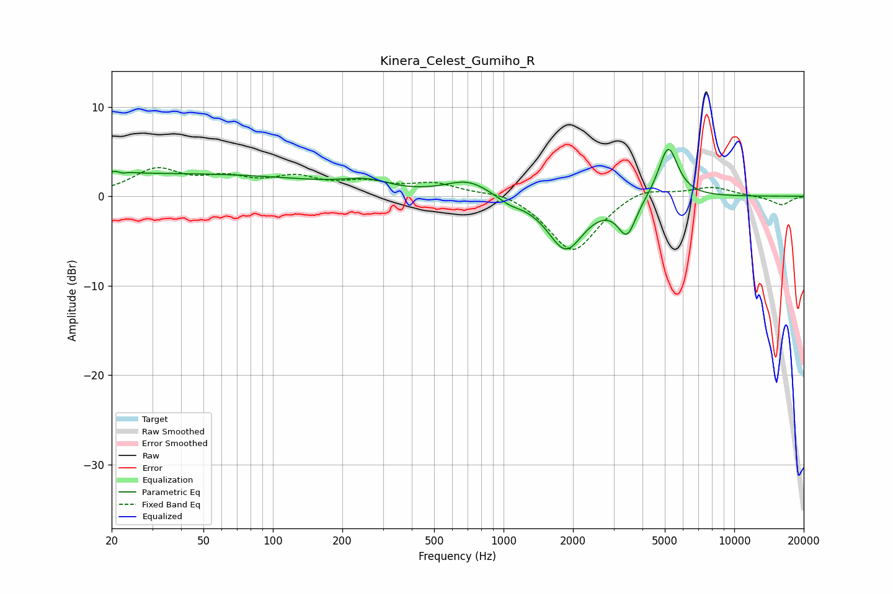

# Kinera_Celest_Gumiho_R
See [usage instructions](https://github.com/jaakkopasanen/AutoEq#usage) for more options and info.

### Parametric EQs
Apply preamp of -5.3 dB when using parametric equalizer.

|   # | Type    |   Fc (Hz) |    Q |   Gain (dB) |
|-----|---------|-----------|------|-------------|
|   1 | Peaking |        22 | 4.8  |         2.5 |
|   2 | Peaking |        22 | 5.52 |        -2.3 |
|   3 | Peaking |        34 | 0.18 |         2.5 |
|   4 | Peaking |       240 | 1.45 |         0.7 |
|   5 | Peaking |       280 | 2.12 |         0.3 |
|   6 | Peaking |       703 | 1.44 |         1.8 |
|   7 | Peaking |      1059 | 2.67 |        -0.7 |
|   8 | Peaking |      1859 | 1.79 |        -5.9 |
|   9 | Peaking |      3430 | 3.55 |        -4   |
|  10 | Peaking |      5171 | 3.3  |         5.9 |

### Fixed Band EQs
When using fixed band (also called graphic) equalizer, apply preamp of **-3.3 dB** (if available) and set gains manually with these parameters.

|   # | Type    |   Fc (Hz) |    Q |   Gain (dB) |
|-----|---------|-----------|------|-------------|
|   1 | Peaking |        31 | 1.41 |         2.8 |
|   2 | Peaking |        62 | 1.41 |         1.6 |
|   3 | Peaking |       125 | 1.41 |         1.8 |
|   4 | Peaking |       250 | 1.41 |         1.3 |
|   5 | Peaking |       500 | 1.41 |         1.3 |
|   6 | Peaking |      1000 | 1.41 |         0.7 |
|   7 | Peaking |      2000 | 1.41 |        -6.4 |
|   8 | Peaking |      4000 | 1.41 |         1.2 |
|   9 | Peaking |      8000 | 1.41 |         1   |
|  10 | Peaking |     16000 | 1.41 |        -1   |

### Graphs

