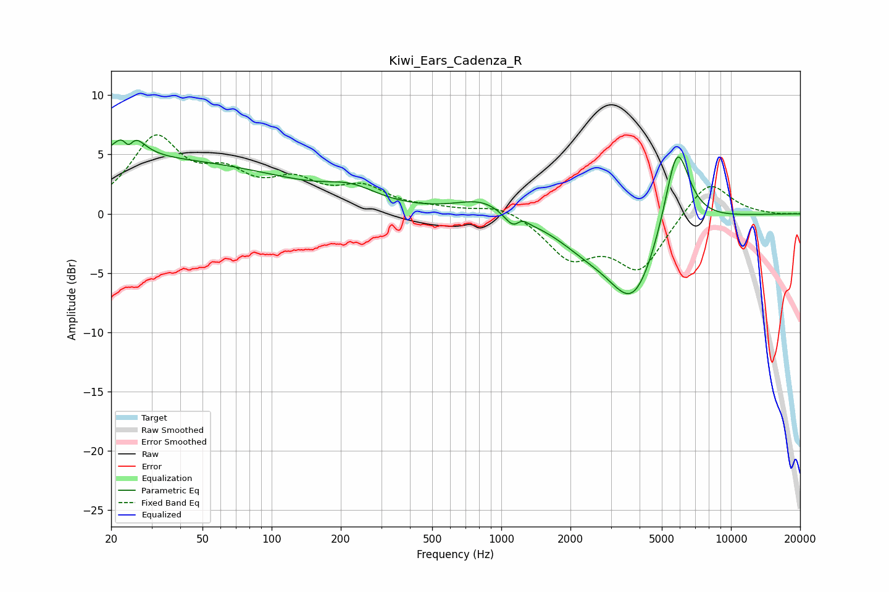

# Kiwi_Ears_Cadenza_R
See [usage instructions](https://github.com/jaakkopasanen/AutoEq#usage) for more options and info.

### Parametric EQs
Apply preamp of -6.3 dB when using parametric equalizer.

|   # | Type    |   Fc (Hz) |    Q |   Gain (dB) |
|-----|---------|-----------|------|-------------|
|   1 | Peaking |        24 | 3.05 |         3.5 |
|   2 | Peaking |        24 | 6    |        -2.2 |
|   3 | Peaking |        25 | 0.18 |         4.5 |
|   4 | Peaking |       222 | 1.27 |         1.2 |
|   5 | Peaking |       834 | 1.24 |         1.3 |
|   6 | Peaking |      1138 | 3.55 |        -1.3 |
|   7 | Peaking |      1222 | 5.38 |         0.7 |
|   8 | Peaking |      2322 | 1.04 |        -1.7 |
|   9 | Peaking |      3764 | 1.26 |        -7   |
|  10 | Peaking |      5815 | 2.48 |         7.8 |

### Fixed Band EQs
When using fixed band (also called graphic) equalizer, apply preamp of **-6.7 dB** (if available) and set gains manually with these parameters.

|   # | Type    |   Fc (Hz) |    Q |   Gain (dB) |
|-----|---------|-----------|------|-------------|
|   1 | Peaking |        31 | 1.41 |         6.1 |
|   2 | Peaking |        62 | 1.41 |         2.6 |
|   3 | Peaking |       125 | 1.41 |         2.3 |
|   4 | Peaking |       250 | 1.41 |         1.9 |
|   5 | Peaking |       500 | 1.41 |         0.3 |
|   6 | Peaking |      1000 | 1.41 |         0.9 |
|   7 | Peaking |      2000 | 1.41 |        -3.5 |
|   8 | Peaking |      4000 | 1.41 |        -4.6 |
|   9 | Peaking |      8000 | 1.41 |         3   |
|  10 | Peaking |     16000 | 1.41 |        -0.1 |

### Graphs

