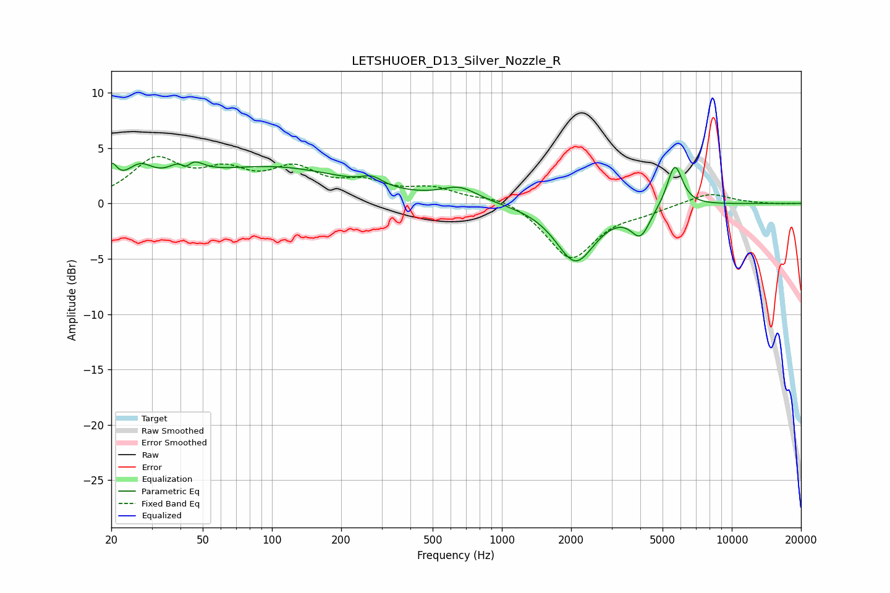

# LETSHUOER_D13_Silver_Nozzle_R
See [usage instructions](https://github.com/jaakkopasanen/AutoEq#usage) for more options and info.

### Parametric EQs
Apply preamp of -3.8 dB when using parametric equalizer.

|   # | Type    |   Fc (Hz) |    Q |   Gain (dB) |
|-----|---------|-----------|------|-------------|
|   1 | Peaking |        20 | 5.84 |         2.1 |
|   2 | Peaking |        27 | 2.34 |         2.1 |
|   3 | Peaking |        42 | 5.01 |        -2.3 |
|   4 | Peaking |        42 | 3.08 |         3.3 |
|   5 | Peaking |        99 | 0.41 |         3.2 |
|   6 | Peaking |       272 | 3.15 |         0.8 |
|   7 | Peaking |       656 | 1.77 |         1.2 |
|   8 | Peaking |      2090 | 1.65 |        -5.2 |
|   9 | Peaking |      4007 | 3.35 |        -2.5 |
|  10 | Peaking |      5649 | 4.14 |         3.9 |

### Fixed Band EQs
When using fixed band (also called graphic) equalizer, apply preamp of **-4.3 dB** (if available) and set gains manually with these parameters.

|   # | Type    |   Fc (Hz) |    Q |   Gain (dB) |
|-----|---------|-----------|------|-------------|
|   1 | Peaking |        31 | 1.41 |         3.7 |
|   2 | Peaking |        62 | 1.41 |         2.3 |
|   3 | Peaking |       125 | 1.41 |         2.7 |
|   4 | Peaking |       250 | 1.41 |         1.5 |
|   5 | Peaking |       500 | 1.41 |         1.2 |
|   6 | Peaking |      1000 | 1.41 |         0.7 |
|   7 | Peaking |      2000 | 1.41 |        -5   |
|   8 | Peaking |      4000 | 1.41 |        -0.6 |
|   9 | Peaking |      8000 | 1.41 |         1   |
|  10 | Peaking |     16000 | 1.41 |        -0   |

### Graphs

