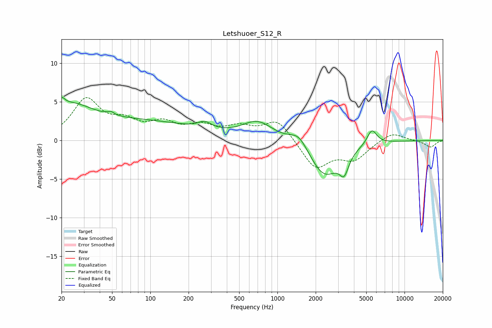

# Letshuoer_S12_R
See [usage instructions](https://github.com/jaakkopasanen/AutoEq#usage) for more options and info.

### Parametric EQs
Apply preamp of -5.7 dB when using parametric equalizer.

|   # | Type    |   Fc (Hz) |    Q |   Gain (dB) |
|-----|---------|-----------|------|-------------|
|   1 | Peaking |        20 | 5.99 |         1   |
|   2 | Peaking |        22 | 0.72 |         4   |
|   3 | Peaking |        49 | 5.87 |         0.4 |
|   4 | Peaking |        94 | 0.35 |         2.2 |
|   5 | Peaking |       268 | 2.68 |         0.9 |
|   6 | Peaking |       698 | 1.17 |         2.3 |
|   7 | Peaking |      1475 | 1.97 |         1.8 |
|   8 | Peaking |      2339 | 1.19 |        -4.7 |
|   9 | Peaking |      3347 | 3.96 |        -2.4 |
|  10 | Peaking |      5537 | 3.68 |         2   |

### Fixed Band EQs
When using fixed band (also called graphic) equalizer, apply preamp of **-5.6 dB** (if available) and set gains manually with these parameters.

|   # | Type    |   Fc (Hz) |    Q |   Gain (dB) |
|-----|---------|-----------|------|-------------|
|   1 | Peaking |        31 | 1.41 |         5.1 |
|   2 | Peaking |        62 | 1.41 |         1.9 |
|   3 | Peaking |       125 | 1.41 |         1.9 |
|   4 | Peaking |       250 | 1.41 |         1.6 |
|   5 | Peaking |       500 | 1.41 |         1.4 |
|   6 | Peaking |      1000 | 1.41 |         2.7 |
|   7 | Peaking |      2000 | 1.41 |        -3.6 |
|   8 | Peaking |      4000 | 1.41 |        -2.3 |
|   9 | Peaking |      8000 | 1.41 |         1.1 |
|  10 | Peaking |     16000 | 1.41 |        -0.9 |

### Graphs

