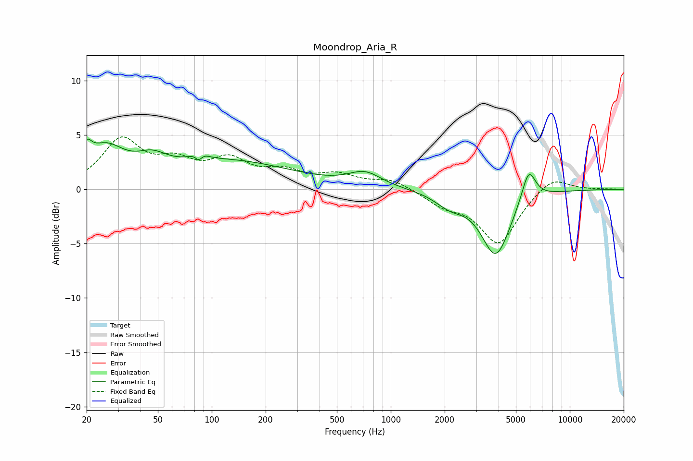

# Moondrop_Aria_R
See [usage instructions](https://github.com/jaakkopasanen/AutoEq#usage) for more options and info.

### Parametric EQs
Apply preamp of -4.7 dB when using parametric equalizer.

|   # | Type    |   Fc (Hz) |    Q |   Gain (dB) |
|-----|---------|-----------|------|-------------|
|   1 | Peaking |        20 | 5.24 |         1.7 |
|   2 | Peaking |        25 | 1.31 |         3.2 |
|   3 | Peaking |        46 | 1.68 |         1.3 |
|   4 | Peaking |        85 | 5.84 |        -2.6 |
|   5 | Peaking |        85 | 4.63 |         2.6 |
|   6 | Peaking |       124 | 0.4  |         2.5 |
|   7 | Peaking |       718 | 1.55 |         1.3 |
|   8 | Peaking |      2138 | 1.73 |        -1.2 |
|   9 | Peaking |      3862 | 1.72 |        -6   |
|  10 | Peaking |      5891 | 3.53 |         3   |

### Fixed Band EQs
When using fixed band (also called graphic) equalizer, apply preamp of **-4.9 dB** (if available) and set gains manually with these parameters.

|   # | Type    |   Fc (Hz) |    Q |   Gain (dB) |
|-----|---------|-----------|------|-------------|
|   1 | Peaking |        31 | 1.41 |         4.3 |
|   2 | Peaking |        62 | 1.41 |         2   |
|   3 | Peaking |       125 | 1.41 |         2.4 |
|   4 | Peaking |       250 | 1.41 |         1.3 |
|   5 | Peaking |       500 | 1.41 |         1.1 |
|   6 | Peaking |      1000 | 1.41 |         0.9 |
|   7 | Peaking |      2000 | 1.41 |        -1.3 |
|   8 | Peaking |      4000 | 1.41 |        -4.9 |
|   9 | Peaking |      8000 | 1.41 |         1.3 |
|  10 | Peaking |     16000 | 1.41 |         0   |

### Graphs

