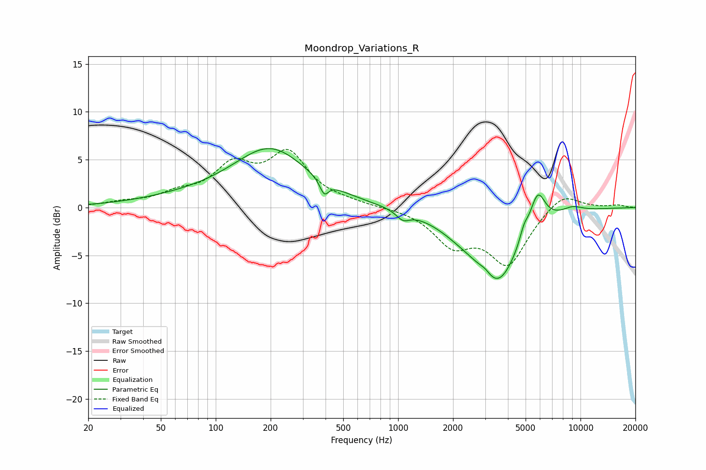

# Moondrop_Variations_R
See [usage instructions](https://github.com/jaakkopasanen/AutoEq#usage) for more options and info.

### Parametric EQs
Apply preamp of -6.3 dB when using parametric equalizer.

|   # | Type    |   Fc (Hz) |    Q |   Gain (dB) |
|-----|---------|-----------|------|-------------|
|   1 | Peaking |        71 | 0.5  |         0.7 |
|   2 | Peaking |       200 | 0.69 |         5.9 |
|   3 | Peaking |       393 | 5.98 |        -1.5 |
|   4 | Peaking |      1062 | 3.83 |        -0.9 |
|   5 | Peaking |      2186 | 1.06 |        -1.3 |
|   6 | Peaking |      3007 | 4.19 |         0.6 |
|   7 | Peaking |      3506 | 1.17 |        -7.4 |
|   8 | Peaking |      4895 | 5.99 |         1.2 |
|   9 | Peaking |      5817 | 3.26 |         3.8 |
|  10 | Peaking |      9010 | 2.18 |         0.6 |

### Fixed Band EQs
When using fixed band (also called graphic) equalizer, apply preamp of **-6.2 dB** (if available) and set gains manually with these parameters.

|   # | Type    |   Fc (Hz) |    Q |   Gain (dB) |
|-----|---------|-----------|------|-------------|
|   1 | Peaking |        31 | 1.41 |         0.4 |
|   2 | Peaking |        62 | 1.41 |         1.2 |
|   3 | Peaking |       125 | 1.41 |         3.9 |
|   4 | Peaking |       250 | 1.41 |         5.3 |
|   5 | Peaking |       500 | 1.41 |         0.4 |
|   6 | Peaking |      1000 | 1.41 |         0   |
|   7 | Peaking |      2000 | 1.41 |        -3.6 |
|   8 | Peaking |      4000 | 1.41 |        -5.7 |
|   9 | Peaking |      8000 | 1.41 |         1.8 |
|  10 | Peaking |     16000 | 1.41 |         0.3 |

### Graphs

