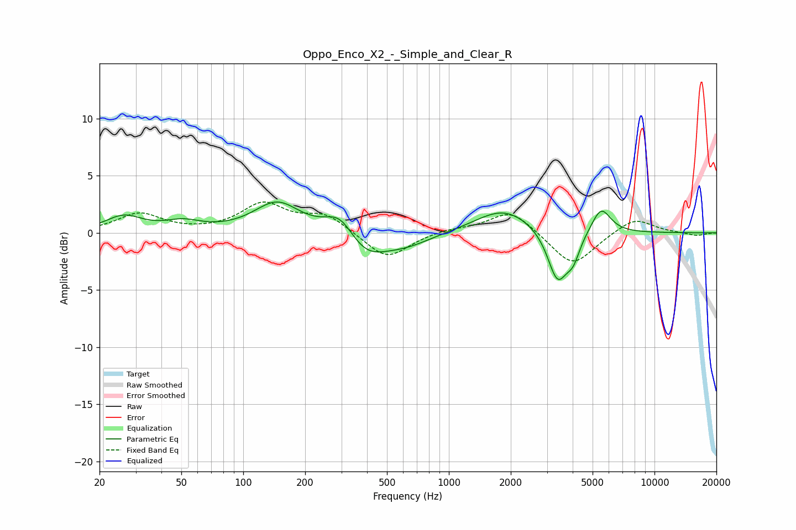

# Oppo_Enco_X2_-_Simple_and_Clear_R
See [usage instructions](https://github.com/jaakkopasanen/AutoEq#usage) for more options and info.

### Parametric EQs
Apply preamp of -2.8 dB when using parametric equalizer.

|   # | Type    |   Fc (Hz) |    Q |   Gain (dB) |
|-----|---------|-----------|------|-------------|
|   1 | Peaking |        26 | 1.63 |         1.4 |
|   2 | Peaking |        51 | 1.62 |         0.8 |
|   3 | Peaking |       146 | 1.27 |         2.6 |
|   4 | Peaking |       296 | 1.94 |         2   |
|   5 | Peaking |       391 | 1.41 |        -2.1 |
|   6 | Peaking |       614 | 1.09 |        -1.1 |
|   7 | Peaking |      1853 | 1.02 |         2.2 |
|   8 | Peaking |      3374 | 2.94 |        -4.4 |
|   9 | Peaking |      4020 | 4.13 |        -1.8 |
|  10 | Peaking |      5500 | 3.01 |         2.3 |

### Fixed Band EQs
When using fixed band (also called graphic) equalizer, apply preamp of **-2.8 dB** (if available) and set gains manually with these parameters.

|   # | Type    |   Fc (Hz) |    Q |   Gain (dB) |
|-----|---------|-----------|------|-------------|
|   1 | Peaking |        31 | 1.41 |         1.6 |
|   2 | Peaking |        62 | 1.41 |         0   |
|   3 | Peaking |       125 | 1.41 |         2.4 |
|   4 | Peaking |       250 | 1.41 |         1.5 |
|   5 | Peaking |       500 | 1.41 |        -2.4 |
|   6 | Peaking |      1000 | 1.41 |         0.3 |
|   7 | Peaking |      2000 | 1.41 |         2   |
|   8 | Peaking |      4000 | 1.41 |        -3   |
|   9 | Peaking |      8000 | 1.41 |         1.4 |
|  10 | Peaking |     16000 | 1.41 |        -0.3 |

### Graphs

