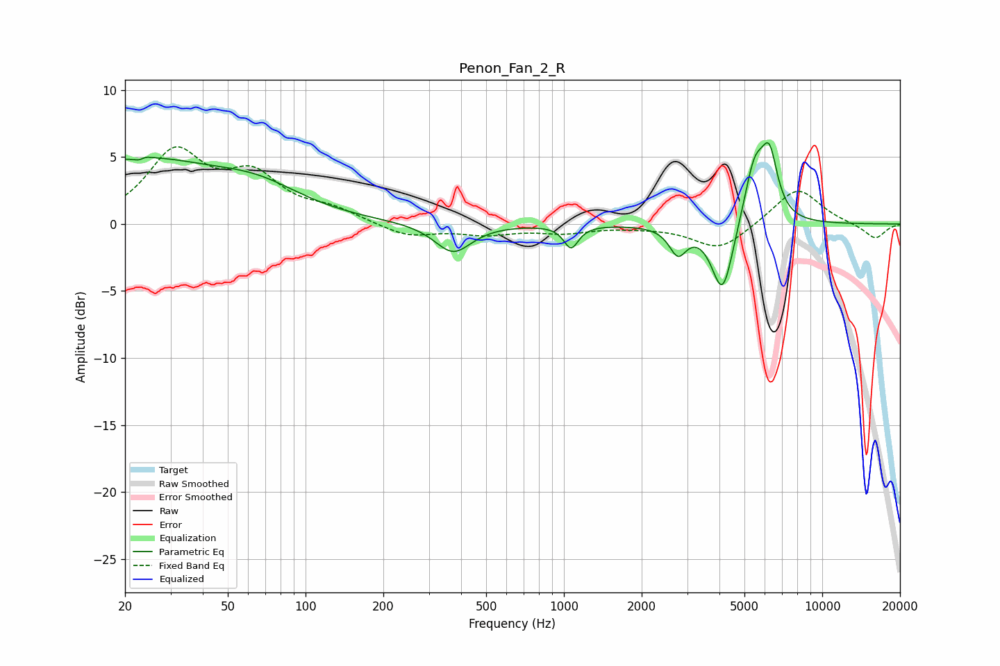

# Penon_Fan_2_R
See [usage instructions](https://github.com/jaakkopasanen/AutoEq#usage) for more options and info.

### Parametric EQs
Apply preamp of -6.2 dB when using parametric equalizer.

|   # | Type    |   Fc (Hz) |    Q |   Gain (dB) |
|-----|---------|-----------|------|-------------|
|   1 | Peaking |        21 | 0.41 |         4.7 |
|   2 | Peaking |        23 | 5.76 |        -3.2 |
|   3 | Peaking |        23 | 5.83 |         3.1 |
|   4 | Peaking |        66 | 0.83 |         1.6 |
|   5 | Peaking |       372 | 2    |        -2.2 |
|   6 | Peaking |      1066 | 5.11 |        -1.7 |
|   7 | Peaking |      2762 | 4.27 |        -2   |
|   8 | Peaking |      4115 | 3.34 |        -5.4 |
|   9 | Peaking |      5469 | 3.34 |         4.5 |
|  10 | Peaking |      6252 | 4.39 |         4.3 |

### Fixed Band EQs
When using fixed band (also called graphic) equalizer, apply preamp of **-5.9 dB** (if available) and set gains manually with these parameters.

|   # | Type    |   Fc (Hz) |    Q |   Gain (dB) |
|-----|---------|-----------|------|-------------|
|   1 | Peaking |        31 | 1.41 |         5.1 |
|   2 | Peaking |        62 | 1.41 |         3.2 |
|   3 | Peaking |       125 | 1.41 |         0.9 |
|   4 | Peaking |       250 | 1.41 |        -0.9 |
|   5 | Peaking |       500 | 1.41 |        -0.7 |
|   6 | Peaking |      1000 | 1.41 |        -0.6 |
|   7 | Peaking |      2000 | 1.41 |        -0.1 |
|   8 | Peaking |      4000 | 1.41 |        -2   |
|   9 | Peaking |      8000 | 1.41 |         2.8 |
|  10 | Peaking |     16000 | 1.41 |        -1.1 |

### Graphs

