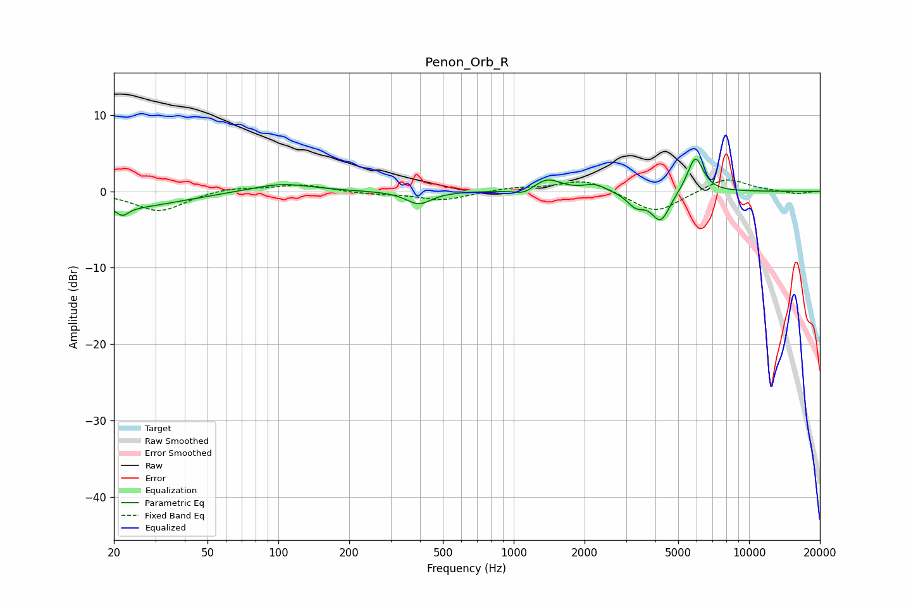

# Penon_Orb_R
See [usage instructions](https://github.com/jaakkopasanen/AutoEq#usage) for more options and info.

### Parametric EQs
Apply preamp of -4.3 dB when using parametric equalizer.

|   # | Type    |   Fc (Hz) |    Q |   Gain (dB) |
|-----|---------|-----------|------|-------------|
|   1 | Peaking |        22 | 5.22 |        -1.2 |
|   2 | Peaking |        24 | 0.68 |        -2   |
|   3 | Peaking |       103 | 1.12 |         1.1 |
|   4 | Peaking |       395 | 2.65 |        -1.7 |
|   5 | Peaking |      1109 | 3.36 |        -0.8 |
|   6 | Peaking |      1384 | 2.43 |         1.7 |
|   7 | Peaking |      2211 | 2.96 |         0.9 |
|   8 | Peaking |      3307 | 3.72 |        -1.7 |
|   9 | Peaking |      4214 | 3.57 |        -3.9 |
|  10 | Peaking |      5911 | 4.07 |         4.7 |

### Fixed Band EQs
When using fixed band (also called graphic) equalizer, apply preamp of **-1.6 dB** (if available) and set gains manually with these parameters.

|   # | Type    |   Fc (Hz) |    Q |   Gain (dB) |
|-----|---------|-----------|------|-------------|
|   1 | Peaking |        31 | 1.41 |        -2.6 |
|   2 | Peaking |        62 | 1.41 |         0.6 |
|   3 | Peaking |       125 | 1.41 |         0.9 |
|   4 | Peaking |       250 | 1.41 |        -0.3 |
|   5 | Peaking |       500 | 1.41 |        -1.2 |
|   6 | Peaking |      1000 | 1.41 |         0.5 |
|   7 | Peaking |      2000 | 1.41 |         1.6 |
|   8 | Peaking |      4000 | 1.41 |        -2.9 |
|   9 | Peaking |      8000 | 1.41 |         1.9 |
|  10 | Peaking |     16000 | 1.41 |        -0.4 |

### Graphs

