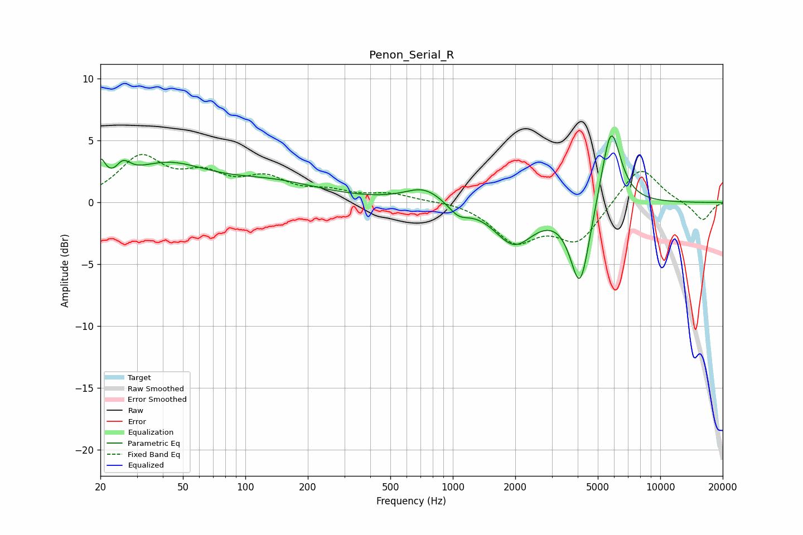

# Penon_Serial_R
See [usage instructions](https://github.com/jaakkopasanen/AutoEq#usage) for more options and info.

### Parametric EQs
Apply preamp of -5.5 dB when using parametric equalizer.

|   # | Type    |   Fc (Hz) |    Q |   Gain (dB) |
|-----|---------|-----------|------|-------------|
|   1 | Peaking |        20 | 5.99 |         2   |
|   2 | Peaking |        26 | 5.29 |         3.2 |
|   3 | Peaking |        26 | 6    |        -2.1 |
|   4 | Peaking |        41 | 0.71 |         2.8 |
|   5 | Peaking |       137 | 0.6  |         1.4 |
|   6 | Peaking |       729 | 1.53 |         1.3 |
|   7 | Peaking |      1065 | 2.84 |        -0.9 |
|   8 | Peaking |      1974 | 1.48 |        -3.2 |
|   9 | Peaking |      4107 | 2.93 |        -6.9 |
|  10 | Peaking |      5782 | 2.88 |         6.8 |

### Fixed Band EQs
When using fixed band (also called graphic) equalizer, apply preamp of **-4.0 dB** (if available) and set gains manually with these parameters.

|   # | Type    |   Fc (Hz) |    Q |   Gain (dB) |
|-----|---------|-----------|------|-------------|
|   1 | Peaking |        31 | 1.41 |         3.5 |
|   2 | Peaking |        62 | 1.41 |         1.9 |
|   3 | Peaking |       125 | 1.41 |         1.7 |
|   4 | Peaking |       250 | 1.41 |         0.7 |
|   5 | Peaking |       500 | 1.41 |         0.6 |
|   6 | Peaking |      1000 | 1.41 |         0.2 |
|   7 | Peaking |      2000 | 1.41 |        -3   |
|   8 | Peaking |      4000 | 1.41 |        -3.1 |
|   9 | Peaking |      8000 | 1.41 |         3.1 |
|  10 | Peaking |     16000 | 1.41 |        -1.5 |

### Graphs

