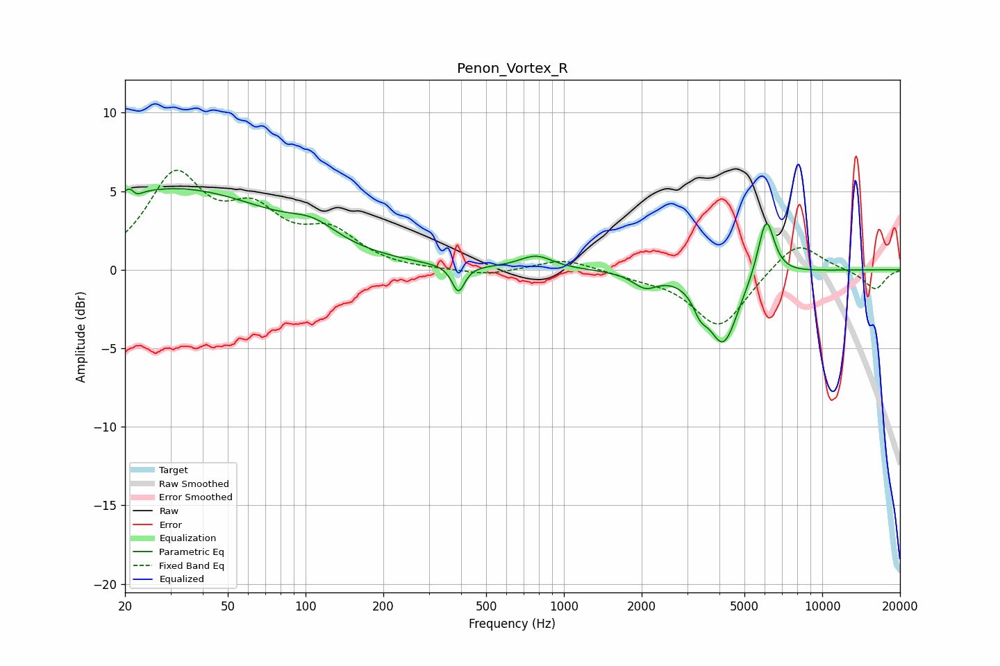

# Penon_Vortex_R
See [usage instructions](https://github.com/jaakkopasanen/AutoEq#usage) for more options and info.

### Parametric EQs
Apply preamp of -5.3 dB when using parametric equalizer.

|   # | Type    |   Fc (Hz) |    Q |   Gain (dB) |
|-----|---------|-----------|------|-------------|
|   1 | Peaking |        21 | 5.87 |         3.3 |
|   2 | Peaking |        22 | 5.98 |        -3.1 |
|   3 | Peaking |        31 | 0.35 |         5.1 |
|   4 | Peaking |       107 | 1.58 |         1   |
|   5 | Peaking |       390 | 5.91 |        -1.7 |
|   6 | Peaking |       780 | 2.18 |         0.9 |
|   7 | Peaking |      2063 | 2.97 |        -0.9 |
|   8 | Peaking |      3370 | 4.99 |        -1.1 |
|   9 | Peaking |      4144 | 2.41 |        -4.6 |
|  10 | Peaking |      6064 | 4.35 |         3.9 |

### Fixed Band EQs
When using fixed band (also called graphic) equalizer, apply preamp of **-6.4 dB** (if available) and set gains manually with these parameters.

|   # | Type    |   Fc (Hz) |    Q |   Gain (dB) |
|-----|---------|-----------|------|-------------|
|   1 | Peaking |        31 | 1.41 |         5.7 |
|   2 | Peaking |        62 | 1.41 |         3.1 |
|   3 | Peaking |       125 | 1.41 |         2.1 |
|   4 | Peaking |       250 | 1.41 |        -0.1 |
|   5 | Peaking |       500 | 1.41 |        -0.4 |
|   6 | Peaking |      1000 | 1.41 |         0.7 |
|   7 | Peaking |      2000 | 1.41 |        -0.4 |
|   8 | Peaking |      4000 | 1.41 |        -3.7 |
|   9 | Peaking |      8000 | 1.41 |         2   |
|  10 | Peaking |     16000 | 1.41 |        -1.3 |

### Graphs

