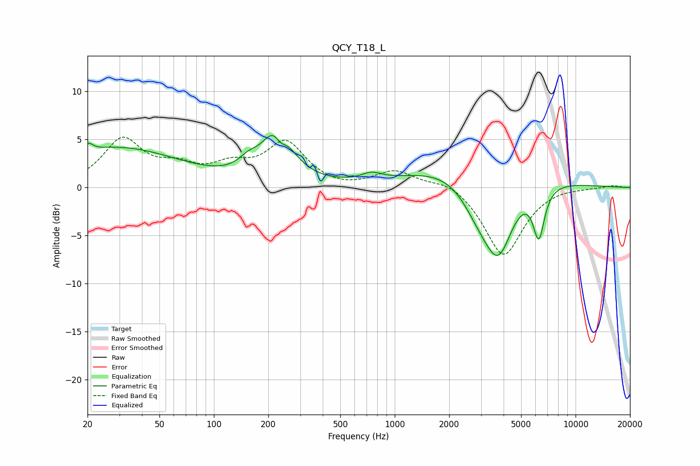

# QCY_T18_L
See [usage instructions](https://github.com/jaakkopasanen/AutoEq#usage) for more options and info.

### Parametric EQs
Apply preamp of -5.5 dB when using parametric equalizer.

|   # | Type    |   Fc (Hz) |    Q |   Gain (dB) |
|-----|---------|-----------|------|-------------|
|   1 | Peaking |        20 | 5.91 |         0.8 |
|   2 | Peaking |        29 | 0.4  |         4.1 |
|   3 | Peaking |       155 | 2.62 |         1   |
|   4 | Peaking |       225 | 1.81 |         6   |
|   5 | Peaking |       233 | 4.27 |        -1.8 |
|   6 | Peaking |       743 | 2.66 |         0.7 |
|   7 | Peaking |      2933 | 1.35 |        -3.7 |
|   8 | Peaking |      2946 | 0.46 |         3.6 |
|   9 | Peaking |      3754 | 1.65 |        -7.8 |
|  10 | Peaking |      6262 | 4.34 |        -5.2 |

### Fixed Band EQs
When using fixed band (also called graphic) equalizer, apply preamp of **-5.3 dB** (if available) and set gains manually with these parameters.

|   # | Type    |   Fc (Hz) |    Q |   Gain (dB) |
|-----|---------|-----------|------|-------------|
|   1 | Peaking |        31 | 1.41 |         4.8 |
|   2 | Peaking |        62 | 1.41 |         1.7 |
|   3 | Peaking |       125 | 1.41 |         1.8 |
|   4 | Peaking |       250 | 1.41 |         4.5 |
|   5 | Peaking |       500 | 1.41 |        -0.3 |
|   6 | Peaking |      1000 | 1.41 |         1.7 |
|   7 | Peaking |      2000 | 1.41 |         0.9 |
|   8 | Peaking |      4000 | 1.41 |        -7.2 |
|   9 | Peaking |      8000 | 1.41 |         0.2 |
|  10 | Peaking |     16000 | 1.41 |         0.2 |

### Graphs

