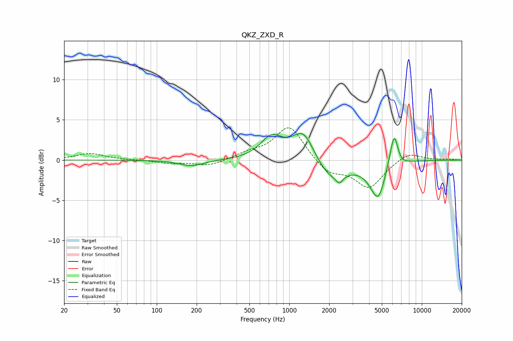

# QKZ_ZXD_R
See [usage instructions](https://github.com/jaakkopasanen/AutoEq#usage) for more options and info.

### Parametric EQs
Apply preamp of -3.4 dB when using parametric equalizer.

|   # | Type    |   Fc (Hz) |    Q |   Gain (dB) |
|-----|---------|-----------|------|-------------|
|   1 | Peaking |       184 | 1.55 |        -0.8 |
|   2 | Peaking |       735 | 1.74 |         2.7 |
|   3 | Peaking |      1279 | 1.65 |         3.9 |
|   4 | Peaking |      2034 | 1.16 |        -2.7 |
|   5 | Peaking |      2388 | 5.91 |        -0.9 |
|   6 | Peaking |      4578 | 2.56 |         0.1 |
|   7 | Peaking |      4721 | 2.21 |        -5.9 |
|   8 | Peaking |      5380 | 1.85 |         1.6 |
|   9 | Peaking |      6189 | 4.58 |         4.1 |
|  10 | Peaking |      6862 | 3.21 |        -0.5 |

### Fixed Band EQs
When using fixed band (also called graphic) equalizer, apply preamp of **-4.1 dB** (if available) and set gains manually with these parameters.

|   # | Type    |   Fc (Hz) |    Q |   Gain (dB) |
|-----|---------|-----------|------|-------------|
|   1 | Peaking |        31 | 1.41 |         0.8 |
|   2 | Peaking |        62 | 1.41 |         0   |
|   3 | Peaking |       125 | 1.41 |        -0.4 |
|   4 | Peaking |       250 | 1.41 |        -0.7 |
|   5 | Peaking |       500 | 1.41 |         0.7 |
|   6 | Peaking |      1000 | 1.41 |         4.3 |
|   7 | Peaking |      2000 | 1.41 |        -1.7 |
|   8 | Peaking |      4000 | 1.41 |        -3.4 |
|   9 | Peaking |      8000 | 1.41 |         1.1 |
|  10 | Peaking |     16000 | 1.41 |         0.1 |

### Graphs

