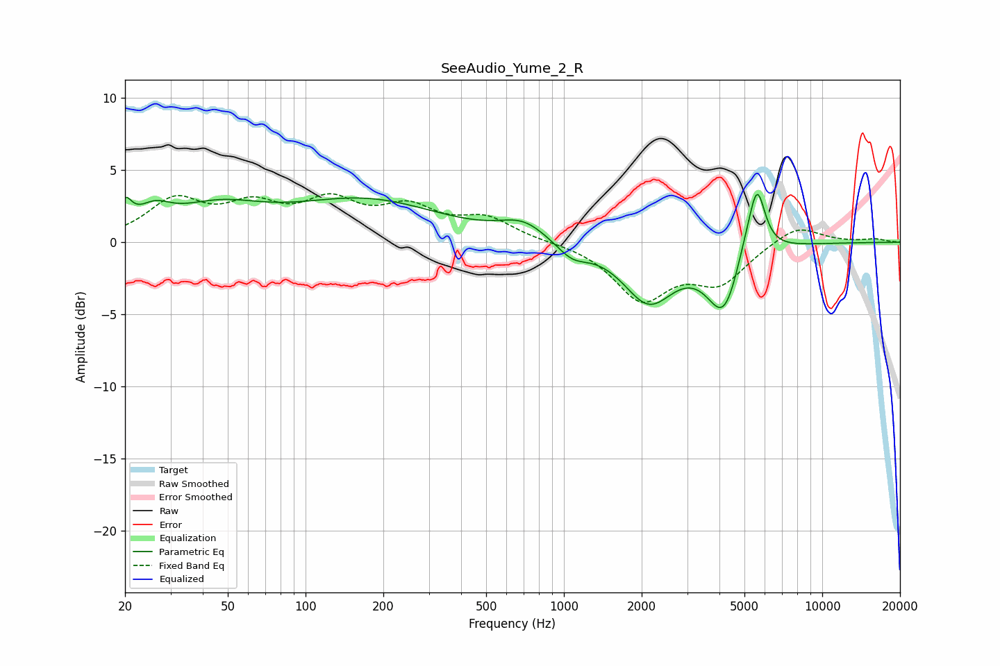

# SeeAudio_Yume_2_R
See [usage instructions](https://github.com/jaakkopasanen/AutoEq#usage) for more options and info.

### Parametric EQs
Apply preamp of -3.4 dB when using parametric equalizer.

|   # | Type    |   Fc (Hz) |    Q |   Gain (dB) |
|-----|---------|-----------|------|-------------|
|   1 | Peaking |        20 | 5.52 |         1.7 |
|   2 | Peaking |        26 | 2.2  |         1.3 |
|   3 | Peaking |        45 | 0.8  |         2   |
|   4 | Peaking |       172 | 0.49 |         2.8 |
|   5 | Peaking |       697 | 1.53 |         1.2 |
|   6 | Peaking |      1075 | 2.29 |        -1.1 |
|   7 | Peaking |      2130 | 1.42 |        -4   |
|   8 | Peaking |      4181 | 2.12 |        -4.9 |
|   9 | Peaking |      5069 | 2.68 |         1.7 |
|  10 | Peaking |      5598 | 4.46 |         4.1 |

### Fixed Band EQs
When using fixed band (also called graphic) equalizer, apply preamp of **-3.5 dB** (if available) and set gains manually with these parameters.

|   # | Type    |   Fc (Hz) |    Q |   Gain (dB) |
|-----|---------|-----------|------|-------------|
|   1 | Peaking |        31 | 1.41 |         2.7 |
|   2 | Peaking |        62 | 1.41 |         2.1 |
|   3 | Peaking |       125 | 1.41 |         2.5 |
|   4 | Peaking |       250 | 1.41 |         2.1 |
|   5 | Peaking |       500 | 1.41 |         1.5 |
|   6 | Peaking |      1000 | 1.41 |         0   |
|   7 | Peaking |      2000 | 1.41 |        -3.8 |
|   8 | Peaking |      4000 | 1.41 |        -2.6 |
|   9 | Peaking |      8000 | 1.41 |         1.3 |
|  10 | Peaking |     16000 | 1.41 |         0.2 |

### Graphs

