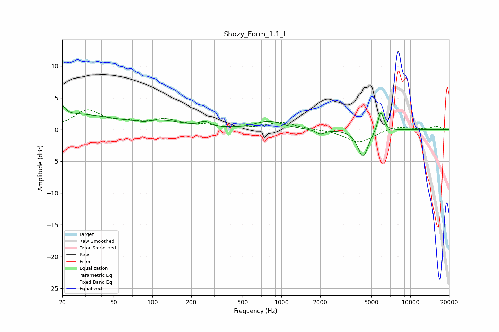

# Shozy_Form_1.1_L
See [usage instructions](https://github.com/jaakkopasanen/AutoEq#usage) for more options and info.

### Parametric EQs
Apply preamp of -3.8 dB when using parametric equalizer.

|   # | Type    |   Fc (Hz) |    Q |   Gain (dB) |
|-----|---------|-----------|------|-------------|
|   1 | Peaking |        20 | 5.91 |         1.5 |
|   2 | Peaking |        26 | 0.5  |         2.3 |
|   3 | Peaking |        89 | 4.49 |        -1.5 |
|   4 | Peaking |        89 | 4.79 |         1.2 |
|   5 | Peaking |       119 | 0.92 |         1.1 |
|   6 | Peaking |       254 | 3.6  |         0.8 |
|   7 | Peaking |       800 | 1.38 |         1.2 |
|   8 | Peaking |      2009 | 4.07 |        -0.7 |
|   9 | Peaking |      4302 | 3.5  |        -4.3 |
|  10 | Peaking |      5906 | 5.97 |         3.2 |

### Fixed Band EQs
When using fixed band (also called graphic) equalizer, apply preamp of **-3.2 dB** (if available) and set gains manually with these parameters.

|   # | Type    |   Fc (Hz) |    Q |   Gain (dB) |
|-----|---------|-----------|------|-------------|
|   1 | Peaking |        31 | 1.41 |         2.9 |
|   2 | Peaking |        62 | 1.41 |         0.8 |
|   3 | Peaking |       125 | 1.41 |         1.4 |
|   4 | Peaking |       250 | 1.41 |         0.6 |
|   5 | Peaking |       500 | 1.41 |         0.1 |
|   6 | Peaking |      1000 | 1.41 |         1.1 |
|   7 | Peaking |      2000 | 1.41 |         0   |
|   8 | Peaking |      4000 | 1.41 |        -2.1 |
|   9 | Peaking |      8000 | 1.41 |         0.6 |
|  10 | Peaking |     16000 | 1.41 |         0.5 |

### Graphs

