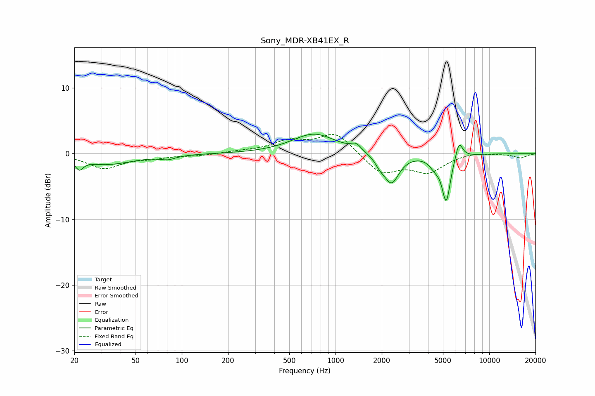

# Sony_MDR-XB41EX_R
See [usage instructions](https://github.com/jaakkopasanen/AutoEq#usage) for more options and info.

### Parametric EQs
Apply preamp of -3.1 dB when using parametric equalizer.

|   # | Type    |   Fc (Hz) |    Q |   Gain (dB) |
|-----|---------|-----------|------|-------------|
|   1 | Peaking |        22 | 5.81 |        -1.4 |
|   2 | Peaking |        32 | 0.82 |        -1.6 |
|   3 | Peaking |        81 | 2.84 |        -0.6 |
|   4 | Peaking |       726 | 0.99 |         3   |
|   5 | Peaking |      1361 | 4.43 |         1   |
|   6 | Peaking |      1937 | 4.85 |        -0.8 |
|   7 | Peaking |      2306 | 2.79 |        -4.5 |
|   8 | Peaking |      4429 | 3.8  |        -1.3 |
|   9 | Peaking |      5255 | 5.08 |        -7   |
|  10 | Peaking |      6361 | 5.79 |         2.7 |

### Fixed Band EQs
When using fixed band (also called graphic) equalizer, apply preamp of **-3.0 dB** (if available) and set gains manually with these parameters.

|   # | Type    |   Fc (Hz) |    Q |   Gain (dB) |
|-----|---------|-----------|------|-------------|
|   1 | Peaking |        31 | 1.41 |        -2.2 |
|   2 | Peaking |        62 | 1.41 |        -0.5 |
|   3 | Peaking |       125 | 1.41 |        -0.3 |
|   4 | Peaking |       250 | 1.41 |         0.3 |
|   5 | Peaking |       500 | 1.41 |         1.8 |
|   6 | Peaking |      1000 | 1.41 |         3.2 |
|   7 | Peaking |      2000 | 1.41 |        -3   |
|   8 | Peaking |      4000 | 1.41 |        -2.6 |
|   9 | Peaking |      8000 | 1.41 |         0.3 |
|  10 | Peaking |     16000 | 1.41 |        -0.6 |

### Graphs

