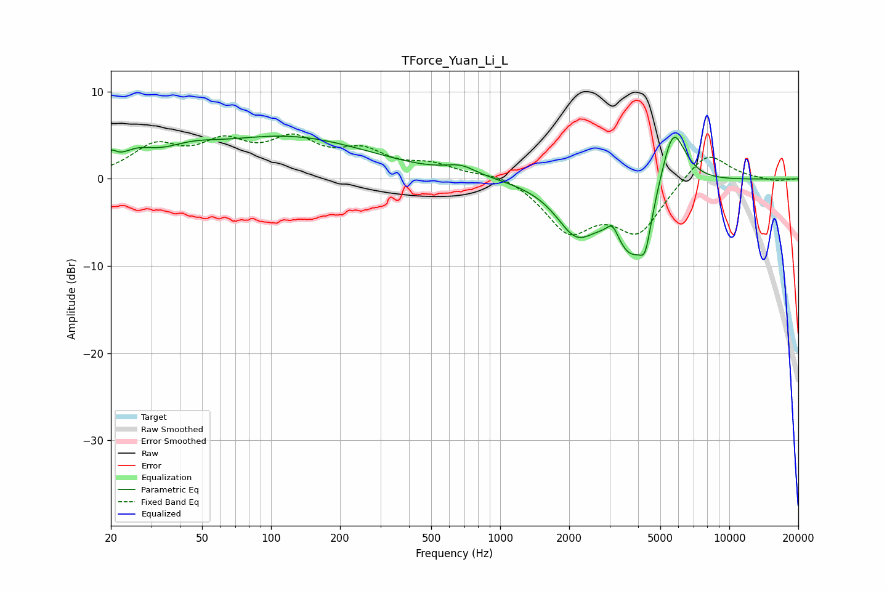

# TForce_Yuan_Li_L
See [usage instructions](https://github.com/jaakkopasanen/AutoEq#usage) for more options and info.

### Parametric EQs
Apply preamp of -5.0 dB when using parametric equalizer.

|   # | Type    |   Fc (Hz) |    Q |   Gain (dB) |
|-----|---------|-----------|------|-------------|
|   1 | Peaking |        20 | 5.98 |         1.4 |
|   2 | Peaking |        26 | 1.88 |         1.7 |
|   3 | Peaking |        44 | 1.18 |         1.4 |
|   4 | Peaking |       119 | 0.39 |         4.7 |
|   5 | Peaking |       674 | 2.13 |         1   |
|   6 | Peaking |      2142 | 1.6  |        -5.2 |
|   7 | Peaking |      3093 | 5.67 |         1.7 |
|   8 | Peaking |      3771 | 1.61 |        -8.3 |
|   9 | Peaking |      4301 | 5.83 |        -3.4 |
|  10 | Peaking |      5667 | 2.44 |         8   |

### Fixed Band EQs
When using fixed band (also called graphic) equalizer, apply preamp of **-5.2 dB** (if available) and set gains manually with these parameters.

|   # | Type    |   Fc (Hz) |    Q |   Gain (dB) |
|-----|---------|-----------|------|-------------|
|   1 | Peaking |        31 | 1.41 |         3.4 |
|   2 | Peaking |        62 | 1.41 |         3.5 |
|   3 | Peaking |       125 | 1.41 |         3.8 |
|   4 | Peaking |       250 | 1.41 |         2.7 |
|   5 | Peaking |       500 | 1.41 |         1.4 |
|   6 | Peaking |      1000 | 1.41 |         0.8 |
|   7 | Peaking |      2000 | 1.41 |        -5.7 |
|   8 | Peaking |      4000 | 1.41 |        -5.8 |
|   9 | Peaking |      8000 | 1.41 |         3.5 |
|  10 | Peaking |     16000 | 1.41 |        -0.3 |

### Graphs

