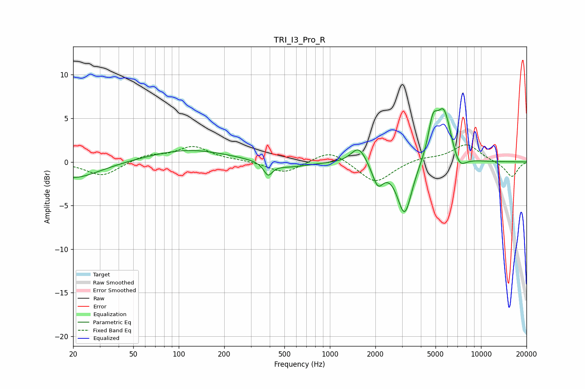

# TRI_I3_Pro_R
See [usage instructions](https://github.com/jaakkopasanen/AutoEq#usage) for more options and info.

### Parametric EQs
Apply preamp of -6.2 dB when using parametric equalizer.

|   # | Type    |   Fc (Hz) |    Q |   Gain (dB) |
|-----|---------|-----------|------|-------------|
|   1 | Peaking |        20 | 0.8  |        -1.9 |
|   2 | Peaking |       116 | 0.54 |         1.4 |
|   3 | Peaking |       390 | 5.07 |        -1.4 |
|   4 | Peaking |       522 | 1.07 |        -0.7 |
|   5 | Peaking |      1553 | 2.82 |         2   |
|   6 | Peaking |      2076 | 3.86 |        -2.5 |
|   7 | Peaking |      3125 | 2.9  |        -6.1 |
|   8 | Peaking |      4802 | 4.49 |         3.7 |
|   9 | Peaking |      5685 | 2.8  |         5.9 |
|  10 | Peaking |      7170 | 3.09 |        -1.7 |

### Fixed Band EQs
When using fixed band (also called graphic) equalizer, apply preamp of **-2.1 dB** (if available) and set gains manually with these parameters.

|   # | Type    |   Fc (Hz) |    Q |   Gain (dB) |
|-----|---------|-----------|------|-------------|
|   1 | Peaking |        31 | 1.41 |        -1.6 |
|   2 | Peaking |        62 | 1.41 |         0.8 |
|   3 | Peaking |       125 | 1.41 |         1.7 |
|   4 | Peaking |       250 | 1.41 |         0.1 |
|   5 | Peaking |       500 | 1.41 |        -1.3 |
|   6 | Peaking |      1000 | 1.41 |         1.5 |
|   7 | Peaking |      2000 | 1.41 |        -2.5 |
|   8 | Peaking |      4000 | 1.41 |         0.5 |
|   9 | Peaking |      8000 | 1.41 |         2   |
|  10 | Peaking |     16000 | 1.41 |        -1.8 |

### Graphs

