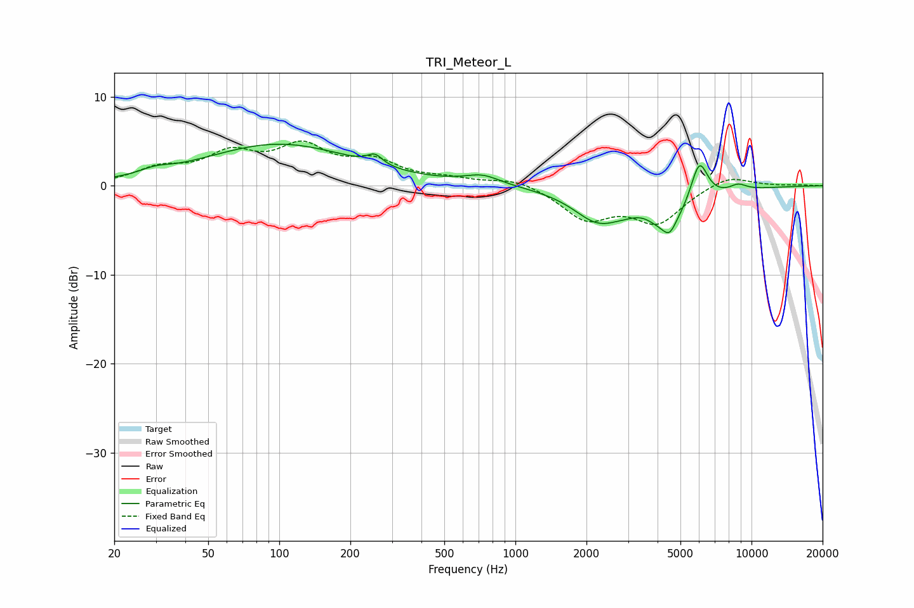

# TRI_Meteor_L
See [usage instructions](https://github.com/jaakkopasanen/AutoEq#usage) for more options and info.

### Parametric EQs
Apply preamp of -4.8 dB when using parametric equalizer.

|   # | Type    |   Fc (Hz) |    Q |   Gain (dB) |
|-----|---------|-----------|------|-------------|
|   1 | Peaking |        30 | 2.25 |         0.6 |
|   2 | Peaking |       100 | 0.44 |         4.6 |
|   3 | Peaking |       254 | 4.55 |         1.1 |
|   4 | Peaking |       726 | 1.91 |         1   |
|   5 | Peaking |      2214 | 1.41 |        -3   |
|   6 | Peaking |      3476 | 2.3  |         1.3 |
|   7 | Peaking |      4141 | 1.05 |        -4.6 |
|   8 | Peaking |      4490 | 5.05 |        -1.5 |
|   9 | Peaking |      6006 | 3.7  |         5   |
|  10 | Peaking |      8775 | 3.4  |         0.8 |

### Fixed Band EQs
When using fixed band (also called graphic) equalizer, apply preamp of **-5.1 dB** (if available) and set gains manually with these parameters.

|   # | Type    |   Fc (Hz) |    Q |   Gain (dB) |
|-----|---------|-----------|------|-------------|
|   1 | Peaking |        31 | 1.41 |         1.7 |
|   2 | Peaking |        62 | 1.41 |         3.2 |
|   3 | Peaking |       125 | 1.41 |         3.9 |
|   4 | Peaking |       250 | 1.41 |         2.4 |
|   5 | Peaking |       500 | 1.41 |         0.6 |
|   6 | Peaking |      1000 | 1.41 |         0.9 |
|   7 | Peaking |      2000 | 1.41 |        -3.5 |
|   8 | Peaking |      4000 | 1.41 |        -3.9 |
|   9 | Peaking |      8000 | 1.41 |         1.3 |
|  10 | Peaking |     16000 | 1.41 |         0.1 |

### Graphs

