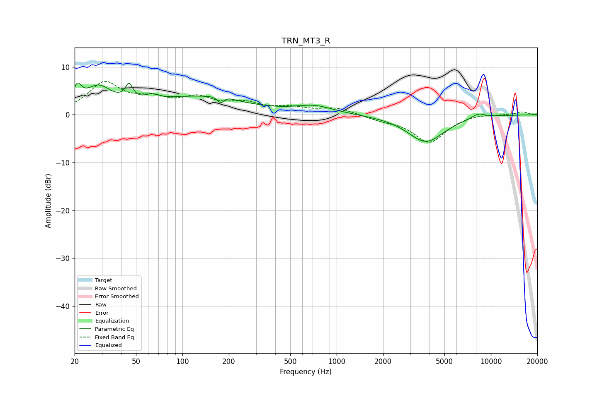

# TRN_MT3_R
See [usage instructions](https://github.com/jaakkopasanen/AutoEq#usage) for more options and info.

### Parametric EQs
Apply preamp of -6.7 dB when using parametric equalizer.

|   # | Type    |   Fc (Hz) |    Q |   Gain (dB) |
|-----|---------|-----------|------|-------------|
|   1 | Peaking |        21 | 5.21 |         3.7 |
|   2 | Peaking |        28 | 1.63 |         5   |
|   3 | Peaking |        45 | 6    |         3.2 |
|   4 | Peaking |        63 | 3.08 |         1.1 |
|   5 | Peaking |       122 | 0.46 |         3.6 |
|   6 | Peaking |       177 | 5.96 |        -2   |
|   7 | Peaking |       180 | 2.92 |         1.2 |
|   8 | Peaking |       719 | 1.15 |         1.6 |
|   9 | Peaking |      3788 | 1.18 |        -5.7 |
|  10 | Peaking |      8298 | 2.98 |         1   |

### Fixed Band EQs
When using fixed band (also called graphic) equalizer, apply preamp of **-7.1 dB** (if available) and set gains manually with these parameters.

|   # | Type    |   Fc (Hz) |    Q |   Gain (dB) |
|-----|---------|-----------|------|-------------|
|   1 | Peaking |        31 | 1.41 |         6.4 |
|   2 | Peaking |        62 | 1.41 |         2.6 |
|   3 | Peaking |       125 | 1.41 |         3   |
|   4 | Peaking |       250 | 1.41 |         2   |
|   5 | Peaking |       500 | 1.41 |         1.2 |
|   6 | Peaking |      1000 | 1.41 |         1.4 |
|   7 | Peaking |      2000 | 1.41 |        -0.9 |
|   8 | Peaking |      4000 | 1.41 |        -5.7 |
|   9 | Peaking |      8000 | 1.41 |         0.3 |
|  10 | Peaking |     16000 | 1.41 |         0.6 |

### Graphs

