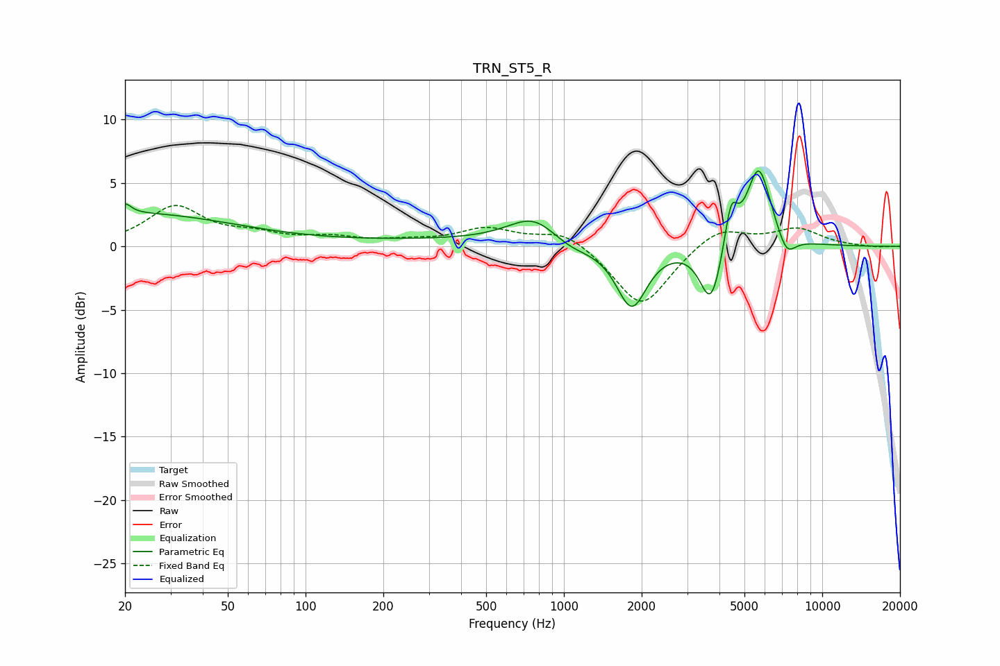

# TRN_ST5_R
See [usage instructions](https://github.com/jaakkopasanen/AutoEq#usage) for more options and info.

### Parametric EQs
Apply preamp of -6.1 dB when using parametric equalizer.

|   # | Type    |   Fc (Hz) |    Q |   Gain (dB) |
|-----|---------|-----------|------|-------------|
|   1 | Peaking |        20 | 5.96 |         0.8 |
|   2 | Peaking |        22 | 0.36 |         2.6 |
|   3 | Peaking |       656 | 0.18 |         0.5 |
|   4 | Peaking |       769 | 1.43 |         2.2 |
|   5 | Peaking |      1048 | 1.55 |        -1   |
|   6 | Peaking |      1830 | 2.36 |        -5.1 |
|   7 | Peaking |      3710 | 3.28 |        -4.9 |
|   8 | Peaking |      4436 | 5.79 |         3.3 |
|   9 | Peaking |      5678 | 2.88 |         6.4 |
|  10 | Peaking |      7272 | 3.8  |        -1.7 |

### Fixed Band EQs
When using fixed band (also called graphic) equalizer, apply preamp of **-3.3 dB** (if available) and set gains manually with these parameters.

|   # | Type    |   Fc (Hz) |    Q |   Gain (dB) |
|-----|---------|-----------|------|-------------|
|   1 | Peaking |        31 | 1.41 |         3.1 |
|   2 | Peaking |        62 | 1.41 |         0.8 |
|   3 | Peaking |       125 | 1.41 |         0.6 |
|   4 | Peaking |       250 | 1.41 |         0.3 |
|   5 | Peaking |       500 | 1.41 |         1.3 |
|   6 | Peaking |      1000 | 1.41 |         1.3 |
|   7 | Peaking |      2000 | 1.41 |        -4.9 |
|   8 | Peaking |      4000 | 1.41 |         1.6 |
|   9 | Peaking |      8000 | 1.41 |         1.4 |
|  10 | Peaking |     16000 | 1.41 |        -0.1 |

### Graphs

