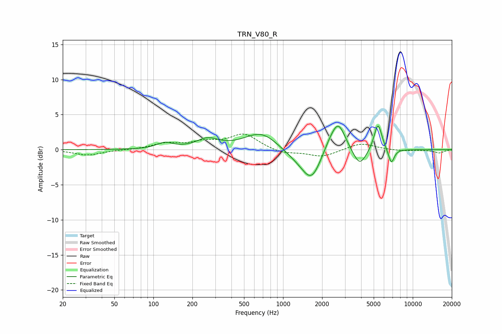

# TRN_V80_R
See [usage instructions](https://github.com/jaakkopasanen/AutoEq#usage) for more options and info.

### Parametric EQs
Apply preamp of -3.5 dB when using parametric equalizer.

|   # | Type    |   Fc (Hz) |    Q |   Gain (dB) |
|-----|---------|-----------|------|-------------|
|   1 | Peaking |       122 | 2.33 |         0.9 |
|   2 | Peaking |       261 | 1.69 |         1.4 |
|   3 | Peaking |       678 | 1.11 |         2.5 |
|   4 | Peaking |      1277 | 1.27 |        -1   |
|   5 | Peaking |      1659 | 1.89 |        -4.2 |
|   6 | Peaking |      2277 | 2.34 |         1.2 |
|   7 | Peaking |      2667 | 2.58 |         3.9 |
|   8 | Peaking |      3895 | 2.79 |        -2.6 |
|   9 | Peaking |      5392 | 4.6  |         4   |
|  10 | Peaking |      6833 | 5.96 |        -2.2 |

### Fixed Band EQs
When using fixed band (also called graphic) equalizer, apply preamp of **-2.3 dB** (if available) and set gains manually with these parameters.

|   # | Type    |   Fc (Hz) |    Q |   Gain (dB) |
|-----|---------|-----------|------|-------------|
|   1 | Peaking |        31 | 1.41 |        -0.8 |
|   2 | Peaking |        62 | 1.41 |        -0   |
|   3 | Peaking |       125 | 1.41 |         0.8 |
|   4 | Peaking |       250 | 1.41 |         1   |
|   5 | Peaking |       500 | 1.41 |         2.2 |
|   6 | Peaking |      1000 | 1.41 |        -0.6 |
|   7 | Peaking |      2000 | 1.41 |        -1   |
|   8 | Peaking |      4000 | 1.41 |         1   |
|   9 | Peaking |      8000 | 1.41 |        -0.2 |
|  10 | Peaking |     16000 | 1.41 |        -0.5 |

### Graphs

