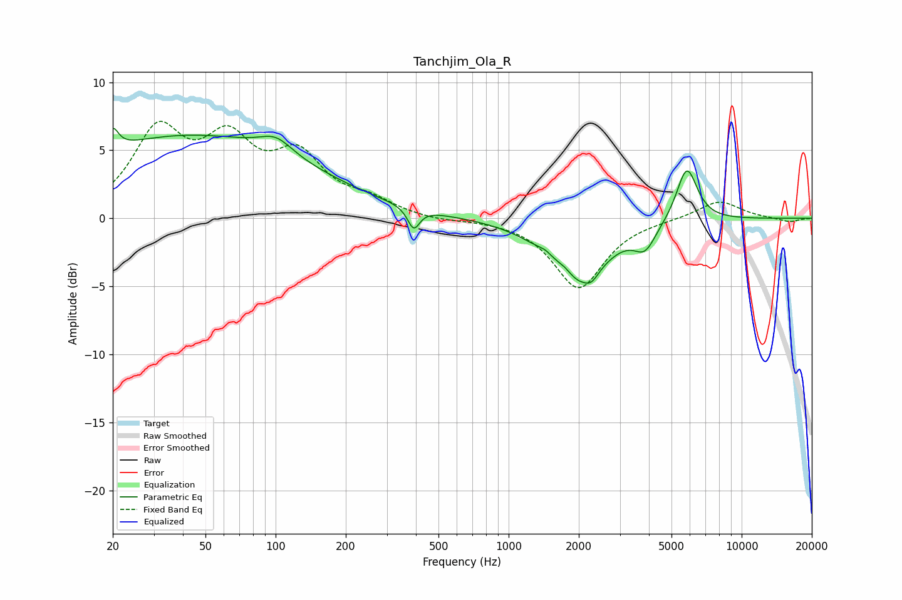

# Tanchjim_Ola_R
See [usage instructions](https://github.com/jaakkopasanen/AutoEq#usage) for more options and info.

### Parametric EQs
Apply preamp of -6.7 dB when using parametric equalizer.

|   # | Type    |   Fc (Hz) |    Q |   Gain (dB) |
|-----|---------|-----------|------|-------------|
|   1 | Peaking |        20 | 6    |         1.5 |
|   2 | Peaking |        42 | 0.26 |         6   |
|   3 | Peaking |       100 | 2.03 |         1.2 |
|   4 | Peaking |       391 | 5.58 |        -1.6 |
|   5 | Peaking |      1445 | 4.14 |         0.4 |
|   6 | Peaking |      1738 | 3.65 |         0.7 |
|   7 | Peaking |      1961 | 1.18 |        -4.8 |
|   8 | Peaking |      2267 | 5.21 |        -0.6 |
|   9 | Peaking |      3851 | 3.04 |        -1.7 |
|  10 | Peaking |      5816 | 3.08 |         4.1 |

### Fixed Band EQs
When using fixed band (also called graphic) equalizer, apply preamp of **-7.2 dB** (if available) and set gains manually with these parameters.

|   # | Type    |   Fc (Hz) |    Q |   Gain (dB) |
|-----|---------|-----------|------|-------------|
|   1 | Peaking |        31 | 1.41 |         6   |
|   2 | Peaking |        62 | 1.41 |         4.9 |
|   3 | Peaking |       125 | 1.41 |         4.1 |
|   4 | Peaking |       250 | 1.41 |         1.1 |
|   5 | Peaking |       500 | 1.41 |        -0.2 |
|   6 | Peaking |      1000 | 1.41 |        -0   |
|   7 | Peaking |      2000 | 1.41 |        -5.1 |
|   8 | Peaking |      4000 | 1.41 |        -0.1 |
|   9 | Peaking |      8000 | 1.41 |         1.3 |
|  10 | Peaking |     16000 | 1.41 |        -0.3 |

### Graphs

