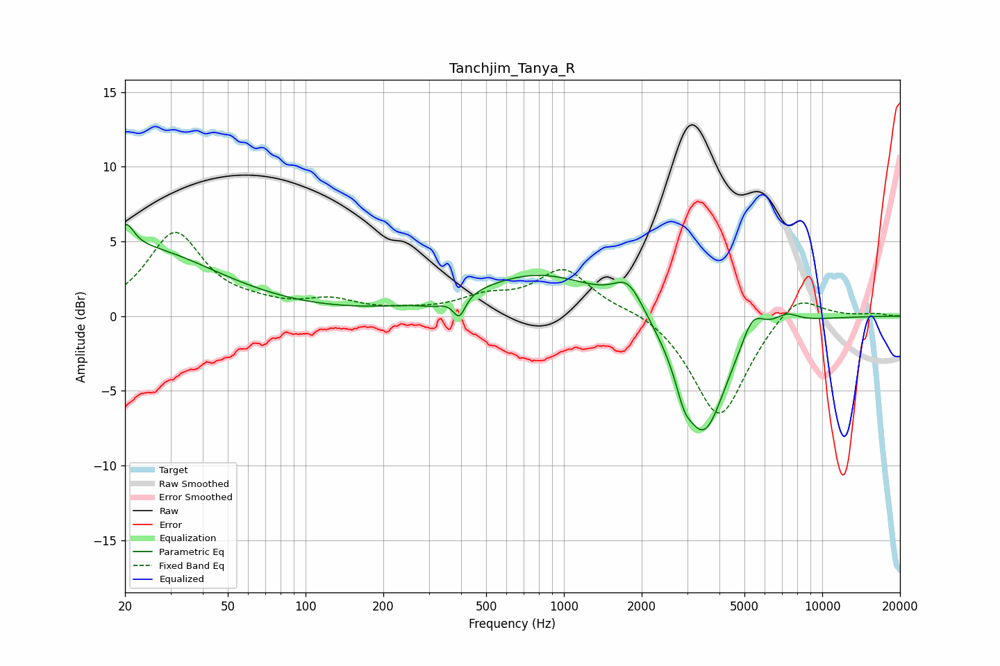

# Tanchjim_Tanya_R
See [usage instructions](https://github.com/jaakkopasanen/AutoEq#usage) for more options and info.

### Parametric EQs
Apply preamp of -6.2 dB when using parametric equalizer.

|   # | Type    |   Fc (Hz) |    Q |   Gain (dB) |
|-----|---------|-----------|------|-------------|
|   1 | Peaking |        20 | 4.73 |         1.7 |
|   2 | Peaking |        22 | 0.47 |         4.5 |
|   3 | Peaking |       313 | 2.71 |        -0.4 |
|   4 | Peaking |       393 | 5.98 |        -1.4 |
|   5 | Peaking |       808 | 0.58 |         2.8 |
|   6 | Peaking |      1776 | 2.41 |         2   |
|   7 | Peaking |      2913 | 4.68 |        -1.4 |
|   8 | Peaking |      3477 | 1.58 |        -8   |
|   9 | Peaking |      5378 | 3.18 |         1.8 |
|  10 | Peaking |      7273 | 2.88 |         0.7 |

### Fixed Band EQs
When using fixed band (also called graphic) equalizer, apply preamp of **-5.7 dB** (if available) and set gains manually with these parameters.

|   # | Type    |   Fc (Hz) |    Q |   Gain (dB) |
|-----|---------|-----------|------|-------------|
|   1 | Peaking |        31 | 1.41 |         5.5 |
|   2 | Peaking |        62 | 1.41 |         0.4 |
|   3 | Peaking |       125 | 1.41 |         0.9 |
|   4 | Peaking |       250 | 1.41 |         0.2 |
|   5 | Peaking |       500 | 1.41 |         1   |
|   6 | Peaking |      1000 | 1.41 |         3   |
|   7 | Peaking |      2000 | 1.41 |         0.5 |
|   8 | Peaking |      4000 | 1.41 |        -6.9 |
|   9 | Peaking |      8000 | 1.41 |         1.8 |
|  10 | Peaking |     16000 | 1.41 |         0.2 |

### Graphs

