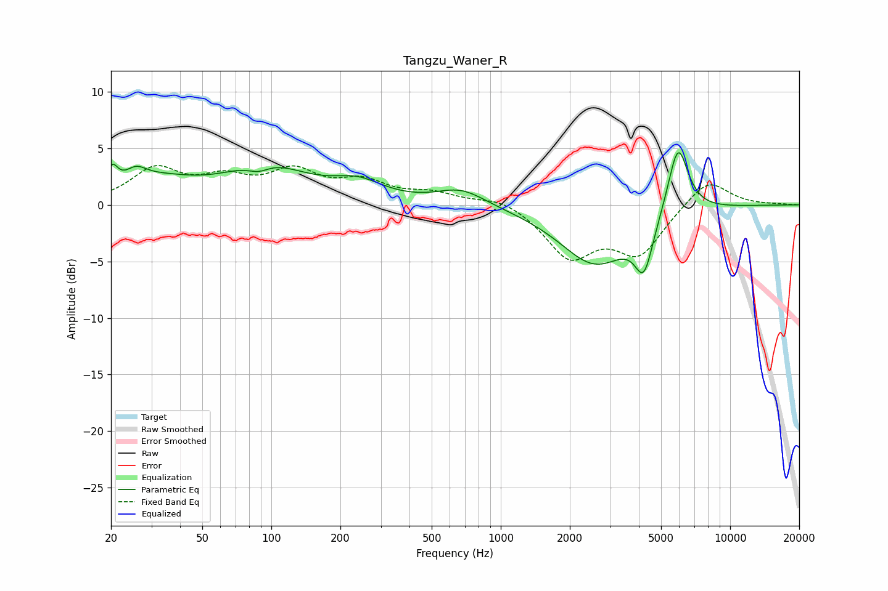

# Tangzu_Waner_R
See [usage instructions](https://github.com/jaakkopasanen/AutoEq#usage) for more options and info.

### Parametric EQs
Apply preamp of -4.7 dB when using parametric equalizer.

|   # | Type    |   Fc (Hz) |    Q |   Gain (dB) |
|-----|---------|-----------|------|-------------|
|   1 | Peaking |        20 | 5.8  |         1.9 |
|   2 | Peaking |        26 | 3.07 |         1.2 |
|   3 | Peaking |        32 | 0.89 |         1.8 |
|   4 | Peaking |        88 | 2.86 |        -0.8 |
|   5 | Peaking |        94 | 0.81 |         3.3 |
|   6 | Peaking |       238 | 1.25 |         1.6 |
|   7 | Peaking |       673 | 1.32 |         1.5 |
|   8 | Peaking |      2585 | 0.91 |        -5.2 |
|   9 | Peaking |      4210 | 3.54 |        -4.2 |
|  10 | Peaking |      5922 | 3.06 |         6.3 |

### Fixed Band EQs
When using fixed band (also called graphic) equalizer, apply preamp of **-3.6 dB** (if available) and set gains manually with these parameters.

|   # | Type    |   Fc (Hz) |    Q |   Gain (dB) |
|-----|---------|-----------|------|-------------|
|   1 | Peaking |        31 | 1.41 |         3   |
|   2 | Peaking |        62 | 1.41 |         1.9 |
|   3 | Peaking |       125 | 1.41 |         2.6 |
|   4 | Peaking |       250 | 1.41 |         1.8 |
|   5 | Peaking |       500 | 1.41 |         0.9 |
|   6 | Peaking |      1000 | 1.41 |         0.8 |
|   7 | Peaking |      2000 | 1.41 |        -4.4 |
|   8 | Peaking |      4000 | 1.41 |        -4.1 |
|   9 | Peaking |      8000 | 1.41 |         2.4 |
|  10 | Peaking |     16000 | 1.41 |         0.1 |

### Graphs

