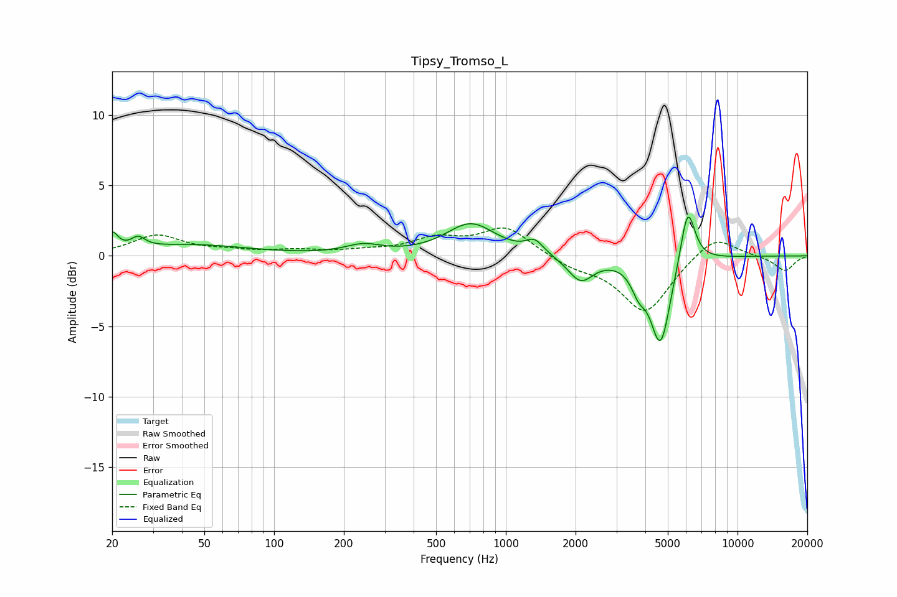

# Tipsy_Tromso_L
See [usage instructions](https://github.com/jaakkopasanen/AutoEq#usage) for more options and info.

### Parametric EQs
Apply preamp of -2.9 dB when using parametric equalizer.

|   # | Type    |   Fc (Hz) |    Q |   Gain (dB) |
|-----|---------|-----------|------|-------------|
|   1 | Peaking |        20 | 5.91 |         1.2 |
|   2 | Peaking |        26 | 4.84 |         0.7 |
|   3 | Peaking |        43 | 0.57 |         0.8 |
|   4 | Peaking |       243 | 1.84 |         0.6 |
|   5 | Peaking |       708 | 1.32 |         2.3 |
|   6 | Peaking |      1331 | 3.76 |         0.9 |
|   7 | Peaking |      2104 | 2.57 |        -1.8 |
|   8 | Peaking |      3743 | 4.44 |        -1.4 |
|   9 | Peaking |      4652 | 3.17 |        -6.2 |
|  10 | Peaking |      6092 | 4.33 |         4.2 |

### Fixed Band EQs
When using fixed band (also called graphic) equalizer, apply preamp of **-2.1 dB** (if available) and set gains manually with these parameters.

|   # | Type    |   Fc (Hz) |    Q |   Gain (dB) |
|-----|---------|-----------|------|-------------|
|   1 | Peaking |        31 | 1.41 |         1.4 |
|   2 | Peaking |        62 | 1.41 |         0.3 |
|   3 | Peaking |       125 | 1.41 |         0.3 |
|   4 | Peaking |       250 | 1.41 |         0.3 |
|   5 | Peaking |       500 | 1.41 |         1.1 |
|   6 | Peaking |      1000 | 1.41 |         2   |
|   7 | Peaking |      2000 | 1.41 |        -0.7 |
|   8 | Peaking |      4000 | 1.41 |        -4   |
|   9 | Peaking |      8000 | 1.41 |         1.6 |
|  10 | Peaking |     16000 | 1.41 |        -1.1 |

### Graphs

