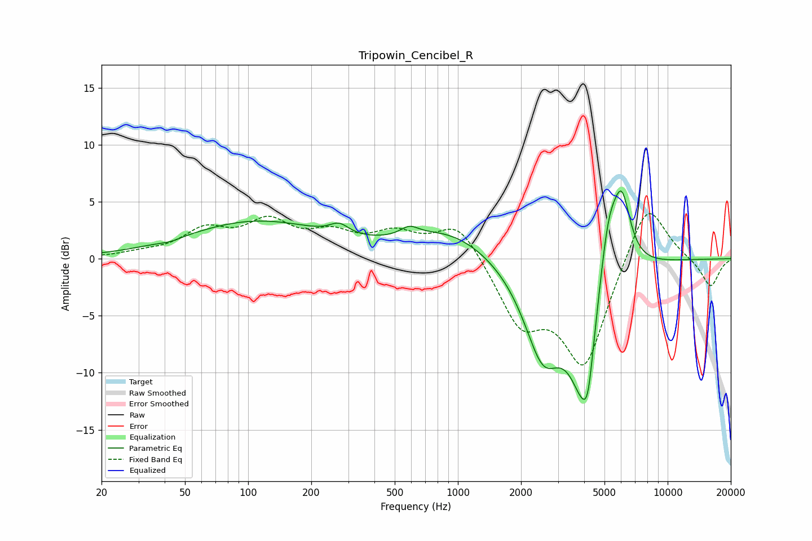

# Tripowin_Cencibel_R
See [usage instructions](https://github.com/jaakkopasanen/AutoEq#usage) for more options and info.

### Parametric EQs
Apply preamp of -6.0 dB when using parametric equalizer.

|   # | Type    |   Fc (Hz) |    Q |   Gain (dB) |
|-----|---------|-----------|------|-------------|
|   1 | Peaking |        43 | 2.99 |        -0.2 |
|   2 | Peaking |       109 | 0.43 |         3.2 |
|   3 | Peaking |       272 | 3.17 |         0.9 |
|   4 | Peaking |       587 | 3.33 |         0.8 |
|   5 | Peaking |       909 | 0.69 |         2.4 |
|   6 | Peaking |      2543 | 1.51 |        -7.8 |
|   7 | Peaking |      3974 | 1.92 |       -10.4 |
|   8 | Peaking |      4172 | 6    |        -2.6 |
|   9 | Peaking |      5218 | 2.85 |         6.3 |
|  10 | Peaking |      6051 | 3.27 |         5.9 |

### Fixed Band EQs
When using fixed band (also called graphic) equalizer, apply preamp of **-4.1 dB** (if available) and set gains manually with these parameters.

|   # | Type    |   Fc (Hz) |    Q |   Gain (dB) |
|-----|---------|-----------|------|-------------|
|   1 | Peaking |        31 | 1.41 |         0.4 |
|   2 | Peaking |        62 | 1.41 |         2.3 |
|   3 | Peaking |       125 | 1.41 |         2.9 |
|   4 | Peaking |       250 | 1.41 |         1.8 |
|   5 | Peaking |       500 | 1.41 |         1.9 |
|   6 | Peaking |      1000 | 1.41 |         3.3 |
|   7 | Peaking |      2000 | 1.41 |        -5.3 |
|   8 | Peaking |      4000 | 1.41 |        -9.3 |
|   9 | Peaking |      8000 | 1.41 |         5.6 |
|  10 | Peaking |     16000 | 1.41 |        -2.5 |

### Graphs

