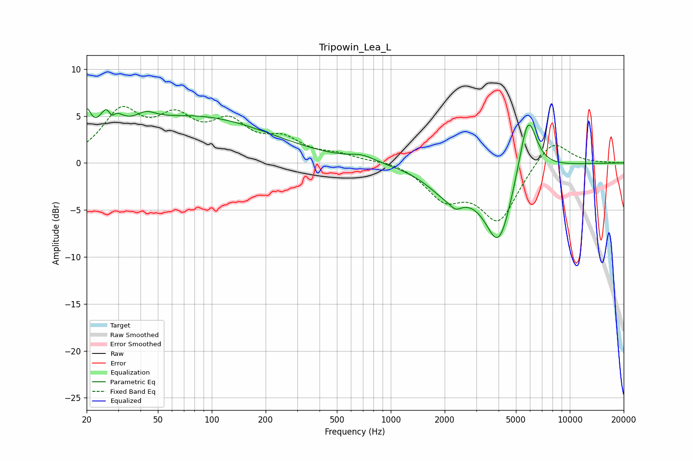

# Tripowin_Lea_L
See [usage instructions](https://github.com/jaakkopasanen/AutoEq#usage) for more options and info.

### Parametric EQs
Apply preamp of -5.8 dB when using parametric equalizer.

|   # | Type    |   Fc (Hz) |    Q |   Gain (dB) |
|-----|---------|-----------|------|-------------|
|   1 | Peaking |        20 | 5.91 |         3   |
|   2 | Peaking |        27 | 3.42 |         4.9 |
|   3 | Peaking |        27 | 5.95 |        -2.9 |
|   4 | Peaking |        43 | 2.53 |         1   |
|   5 | Peaking |        80 | 0.33 |         4.9 |
|   6 | Peaking |       694 | 2.06 |         0.6 |
|   7 | Peaking |      2134 | 1.15 |        -3   |
|   8 | Peaking |      2305 | 4.88 |        -0.7 |
|   9 | Peaking |      4013 | 1.77 |        -8.2 |
|  10 | Peaking |      5822 | 2.76 |         7   |

### Fixed Band EQs
When using fixed band (also called graphic) equalizer, apply preamp of **-6.1 dB** (if available) and set gains manually with these parameters.

|   # | Type    |   Fc (Hz) |    Q |   Gain (dB) |
|-----|---------|-----------|------|-------------|
|   1 | Peaking |        31 | 1.41 |         5.1 |
|   2 | Peaking |        62 | 1.41 |         4   |
|   3 | Peaking |       125 | 1.41 |         3.7 |
|   4 | Peaking |       250 | 1.41 |         2.1 |
|   5 | Peaking |       500 | 1.41 |         0.7 |
|   6 | Peaking |      1000 | 1.41 |         0.3 |
|   7 | Peaking |      2000 | 1.41 |        -3.4 |
|   8 | Peaking |      4000 | 1.41 |        -6   |
|   9 | Peaking |      8000 | 1.41 |         2.8 |
|  10 | Peaking |     16000 | 1.41 |         0   |

### Graphs

