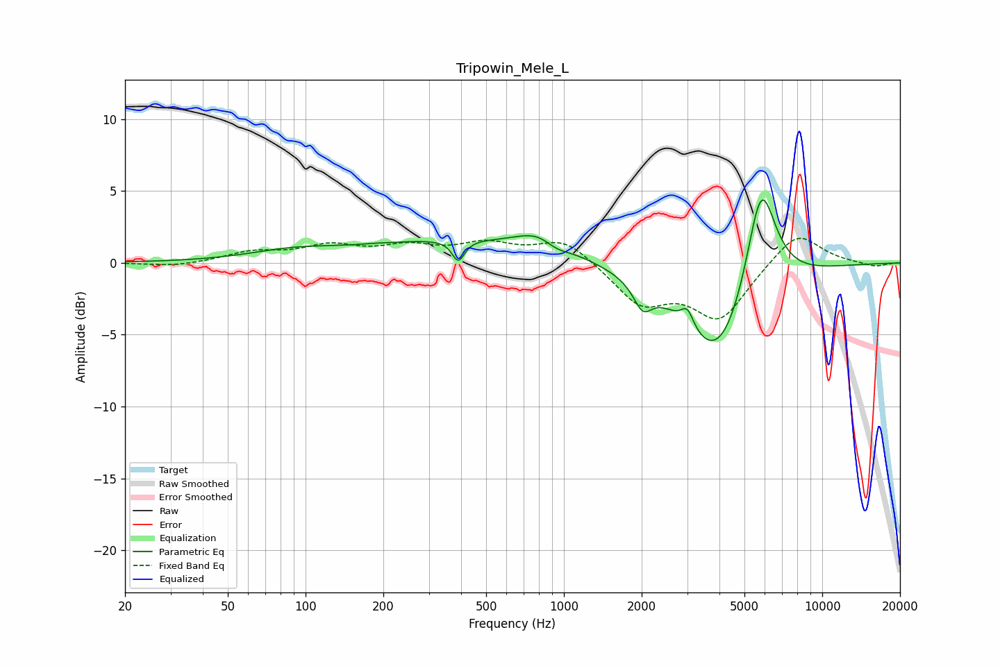

# Tripowin_Mele_L
See [usage instructions](https://github.com/jaakkopasanen/AutoEq#usage) for more options and info.

### Parametric EQs
Apply preamp of -4.5 dB when using parametric equalizer.

|   # | Type    |   Fc (Hz) |    Q |   Gain (dB) |
|-----|---------|-----------|------|-------------|
|   1 | Peaking |        89 | 0.82 |         0.7 |
|   2 | Peaking |       183 | 3.64 |         0   |
|   3 | Peaking |       348 | 0.43 |         1.4 |
|   4 | Peaking |       390 | 5.99 |        -1.5 |
|   5 | Peaking |       850 | 1.44 |         2   |
|   6 | Peaking |       928 | 2.39 |        -1.1 |
|   7 | Peaking |      2018 | 3.97 |        -1.7 |
|   8 | Peaking |      3004 | 5.81 |         1.3 |
|   9 | Peaking |      3975 | 0.99 |        -7.3 |
|  10 | Peaking |      5789 | 2.28 |         8.5 |

### Fixed Band EQs
When using fixed band (also called graphic) equalizer, apply preamp of **-1.8 dB** (if available) and set gains manually with these parameters.

|   # | Type    |   Fc (Hz) |    Q |   Gain (dB) |
|-----|---------|-----------|------|-------------|
|   1 | Peaking |        31 | 1.41 |        -0.3 |
|   2 | Peaking |        62 | 1.41 |         0.7 |
|   3 | Peaking |       125 | 1.41 |         1.1 |
|   4 | Peaking |       250 | 1.41 |         1   |
|   5 | Peaking |       500 | 1.41 |         1.2 |
|   6 | Peaking |      1000 | 1.41 |         1.7 |
|   7 | Peaking |      2000 | 1.41 |        -2.8 |
|   8 | Peaking |      4000 | 1.41 |        -3.8 |
|   9 | Peaking |      8000 | 1.41 |         2.3 |
|  10 | Peaking |     16000 | 1.41 |        -0.3 |

### Graphs

