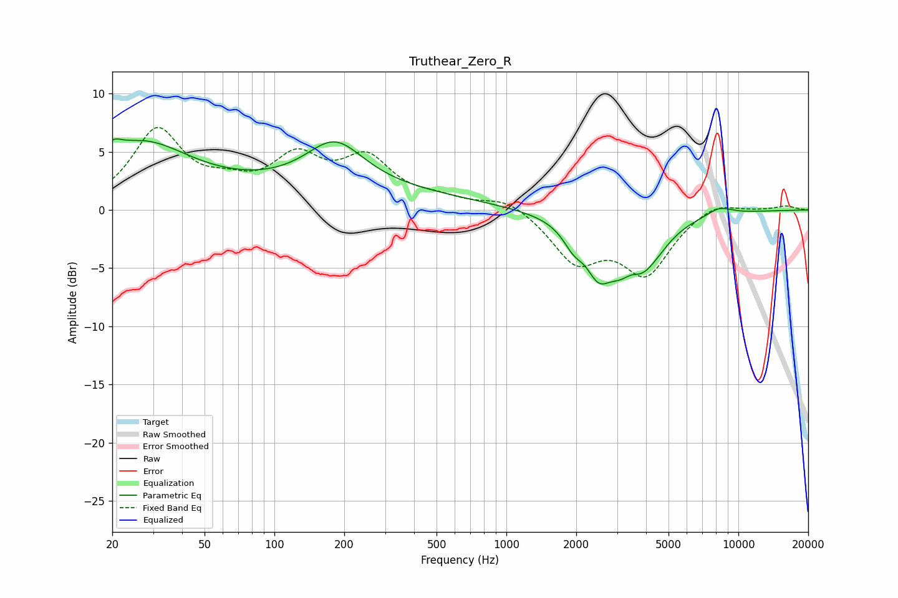

# Truthear_Zero_R
See [usage instructions](https://github.com/jaakkopasanen/AutoEq#usage) for more options and info.

### Parametric EQs
Apply preamp of -6.2 dB when using parametric equalizer.

|   # | Type    |   Fc (Hz) |    Q |   Gain (dB) |
|-----|---------|-----------|------|-------------|
|   1 | Peaking |        20 | 3.69 |         1.1 |
|   2 | Peaking |        26 | 0.68 |         5.1 |
|   3 | Peaking |       164 | 0.23 |         1.7 |
|   4 | Peaking |       182 | 1.14 |         3.9 |
|   5 | Peaking |      1946 | 3.2  |        -1.5 |
|   6 | Peaking |      2481 | 2.91 |        -2.6 |
|   7 | Peaking |      3462 | 3.24 |         1.6 |
|   8 | Peaking |      3488 | 1.27 |        -6.8 |
|   9 | Peaking |      5581 | 1.59 |         0.4 |
|  10 | Peaking |      8251 | 2.22 |         0.8 |

### Fixed Band EQs
When using fixed band (also called graphic) equalizer, apply preamp of **-7.2 dB** (if available) and set gains manually with these parameters.

|   # | Type    |   Fc (Hz) |    Q |   Gain (dB) |
|-----|---------|-----------|------|-------------|
|   1 | Peaking |        31 | 1.41 |         6.6 |
|   2 | Peaking |        62 | 1.41 |         1.4 |
|   3 | Peaking |       125 | 1.41 |         4   |
|   4 | Peaking |       250 | 1.41 |         4   |
|   5 | Peaking |       500 | 1.41 |         0.7 |
|   6 | Peaking |      1000 | 1.41 |         1.1 |
|   7 | Peaking |      2000 | 1.41 |        -4.2 |
|   8 | Peaking |      4000 | 1.41 |        -5.2 |
|   9 | Peaking |      8000 | 1.41 |         0.9 |
|  10 | Peaking |     16000 | 1.41 |         0.4 |

### Graphs

