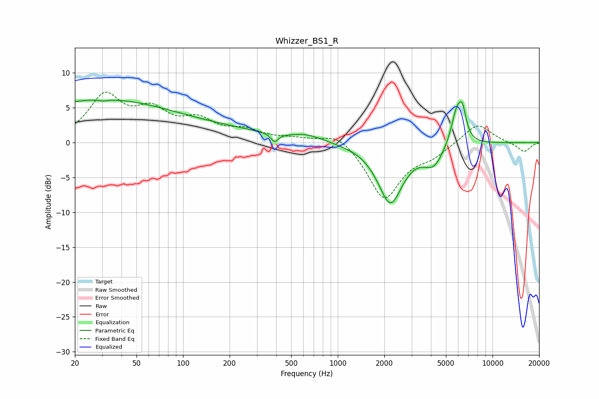

# Whizzer_BS1_R
See [usage instructions](https://github.com/jaakkopasanen/AutoEq#usage) for more options and info.

### Parametric EQs
Apply preamp of -6.2 dB when using parametric equalizer.

|   # | Type    |   Fc (Hz) |    Q |   Gain (dB) |
|-----|---------|-----------|------|-------------|
|   1 | Peaking |        29 | 0.28 |         6.1 |
|   2 | Peaking |        31 | 5.88 |        -3.4 |
|   3 | Peaking |        31 | 5.91 |         3.2 |
|   4 | Peaking |       205 | 0.46 |         1.1 |
|   5 | Peaking |       391 | 6    |        -1.2 |
|   6 | Peaking |       634 | 1.43 |         0.8 |
|   7 | Peaking |      2186 | 1.75 |        -8.5 |
|   8 | Peaking |      4167 | 2.2  |        -2.8 |
|   9 | Peaking |      5870 | 3.73 |         4.8 |
|  10 | Peaking |      6398 | 5.74 |         3.4 |

### Fixed Band EQs
When using fixed band (also called graphic) equalizer, apply preamp of **-7.3 dB** (if available) and set gains manually with these parameters.

|   # | Type    |   Fc (Hz) |    Q |   Gain (dB) |
|-----|---------|-----------|------|-------------|
|   1 | Peaking |        31 | 1.41 |         6.4 |
|   2 | Peaking |        62 | 1.41 |         3.9 |
|   3 | Peaking |       125 | 1.41 |         2.7 |
|   4 | Peaking |       250 | 1.41 |         1.5 |
|   5 | Peaking |       500 | 1.41 |         0.5 |
|   6 | Peaking |      1000 | 1.41 |         1.7 |
|   7 | Peaking |      2000 | 1.41 |        -8.1 |
|   8 | Peaking |      4000 | 1.41 |        -1.5 |
|   9 | Peaking |      8000 | 1.41 |         2.9 |
|  10 | Peaking |     16000 | 1.41 |        -1.4 |

### Graphs

