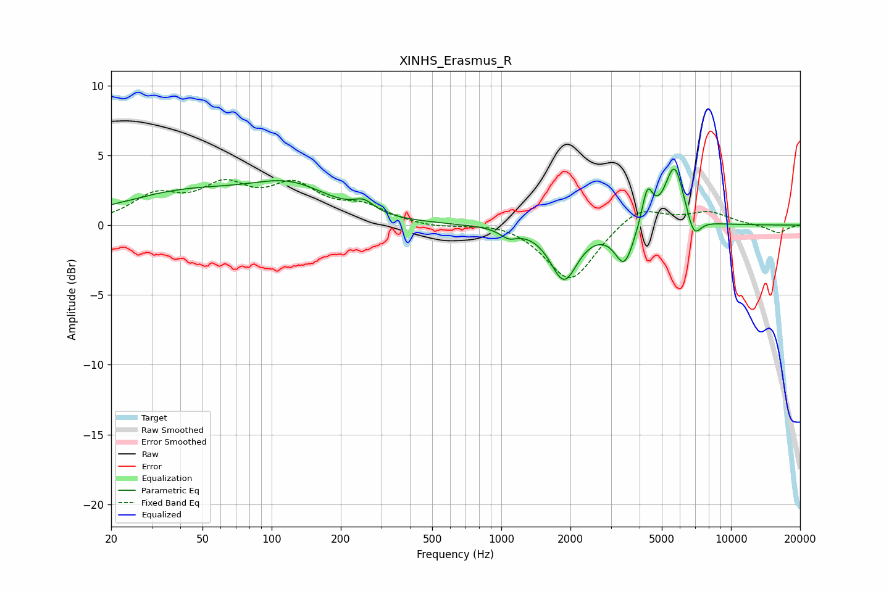

# XINHS_Erasmus_R
See [usage instructions](https://github.com/jaakkopasanen/AutoEq#usage) for more options and info.

### Parametric EQs
Apply preamp of -4.1 dB when using parametric equalizer.

|   # | Type    |   Fc (Hz) |    Q |   Gain (dB) |
|-----|---------|-----------|------|-------------|
|   1 | Peaking |        26 | 5.85 |        -0   |
|   2 | Peaking |        42 | 0.47 |         2.2 |
|   3 | Peaking |       122 | 0.81 |         2.2 |
|   4 | Peaking |       252 | 3.21 |         0.8 |
|   5 | Peaking |      1075 | 3.88 |        -0.6 |
|   6 | Peaking |      1874 | 2.41 |        -3.8 |
|   7 | Peaking |      3434 | 3.43 |        -2.8 |
|   8 | Peaking |      4327 | 5.92 |         2.6 |
|   9 | Peaking |      5676 | 3.28 |         4.4 |
|  10 | Peaking |      6881 | 4.42 |        -1.7 |

### Fixed Band EQs
When using fixed band (also called graphic) equalizer, apply preamp of **-3.4 dB** (if available) and set gains manually with these parameters.

|   # | Type    |   Fc (Hz) |    Q |   Gain (dB) |
|-----|---------|-----------|------|-------------|
|   1 | Peaking |        31 | 1.41 |         1.9 |
|   2 | Peaking |        62 | 1.41 |         2.4 |
|   3 | Peaking |       125 | 1.41 |         2.5 |
|   4 | Peaking |       250 | 1.41 |         1.2 |
|   5 | Peaking |       500 | 1.41 |        -0.2 |
|   6 | Peaking |      1000 | 1.41 |         0.3 |
|   7 | Peaking |      2000 | 1.41 |        -4.1 |
|   8 | Peaking |      4000 | 1.41 |         1.4 |
|   9 | Peaking |      8000 | 1.41 |         0.9 |
|  10 | Peaking |     16000 | 1.41 |        -0.6 |

### Graphs

