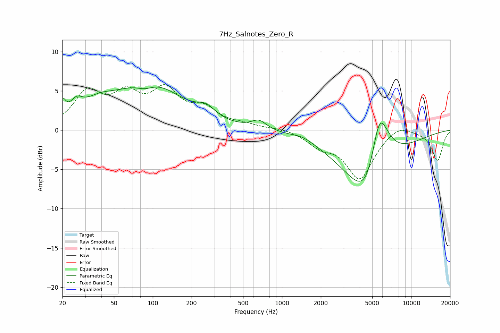

# 7Hz_Salnotes_Zero_R
See [usage instructions](https://github.com/jaakkopasanen/AutoEq#usage) for more options and info.

### Parametric EQs
Apply preamp of -5.6 dB when using parametric equalizer.

|   # | Type    |   Fc (Hz) |    Q |   Gain (dB) |
|-----|---------|-----------|------|-------------|
|   1 | Peaking |        20 | 5.86 |         2.1 |
|   2 | Peaking |        26 | 2.93 |         1.7 |
|   3 | Peaking |        38 | 1.14 |         1.9 |
|   4 | Peaking |        87 | 1.96 |        -1.1 |
|   5 | Peaking |        93 | 0.57 |         6   |
|   6 | Peaking |       259 | 2.04 |         1.3 |
|   7 | Peaking |       664 | 2.46 |         1.1 |
|   8 | Peaking |      1454 | 1.81 |         0.5 |
|   9 | Peaking |      4741 | 0.85 |       -12.9 |
|  10 | Peaking |      5650 | 1.59 |        11.9 |

### Fixed Band EQs
When using fixed band (also called graphic) equalizer, apply preamp of **-5.9 dB** (if available) and set gains manually with these parameters.

|   # | Type    |   Fc (Hz) |    Q |   Gain (dB) |
|-----|---------|-----------|------|-------------|
|   1 | Peaking |        31 | 1.41 |         4.5 |
|   2 | Peaking |        62 | 1.41 |         3.8 |
|   3 | Peaking |       125 | 1.41 |         4.5 |
|   4 | Peaking |       250 | 1.41 |         2.3 |
|   5 | Peaking |       500 | 1.41 |         0.5 |
|   6 | Peaking |      1000 | 1.41 |         0.3 |
|   7 | Peaking |      2000 | 1.41 |        -1.7 |
|   8 | Peaking |      4000 | 1.41 |        -6   |
|   9 | Peaking |      8000 | 1.41 |         1   |
|  10 | Peaking |     16000 | 1.41 |        -3.8 |

### Graphs

