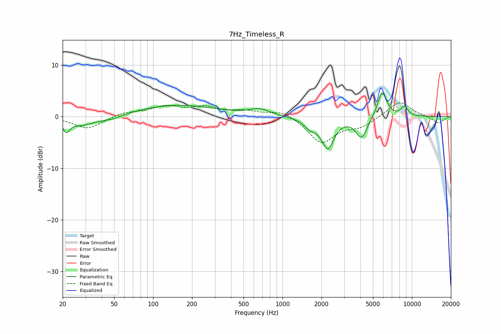

# 7Hz_Timeless_R
See [usage instructions](https://github.com/jaakkopasanen/AutoEq#usage) for more options and info.

### Parametric EQs
Apply preamp of -4.6 dB when using parametric equalizer.

|   # | Type    |   Fc (Hz) |    Q |   Gain (dB) |
|-----|---------|-----------|------|-------------|
|   1 | Peaking |        21 | 5.74 |        -2.1 |
|   2 | Peaking |        28 | 1.3  |        -1.7 |
|   3 | Peaking |        49 | 1.88 |        -0.7 |
|   4 | Peaking |       153 | 0.47 |         2.2 |
|   5 | Peaking |       663 | 1.88 |         1.2 |
|   6 | Peaking |      1634 | 2.77 |        -1.6 |
|   7 | Peaking |      2237 | 3.01 |        -5.8 |
|   8 | Peaking |      4085 | 3.16 |        -4.1 |
|   9 | Peaking |      5889 | 3.76 |         5.1 |
|  10 | Peaking |      8752 | 4.78 |         1.8 |

### Fixed Band EQs
When using fixed band (also called graphic) equalizer, apply preamp of **-2.7 dB** (if available) and set gains manually with these parameters.

|   # | Type    |   Fc (Hz) |    Q |   Gain (dB) |
|-----|---------|-----------|------|-------------|
|   1 | Peaking |        31 | 1.41 |        -2.4 |
|   2 | Peaking |        62 | 1.41 |         0.8 |
|   3 | Peaking |       125 | 1.41 |         1.8 |
|   4 | Peaking |       250 | 1.41 |         1.6 |
|   5 | Peaking |       500 | 1.41 |         0.9 |
|   6 | Peaking |      1000 | 1.41 |         1.3 |
|   7 | Peaking |      2000 | 1.41 |        -5.1 |
|   8 | Peaking |      4000 | 1.41 |        -1.7 |
|   9 | Peaking |      8000 | 1.41 |         3.1 |
|  10 | Peaking |     16000 | 1.41 |        -1.3 |

### Graphs

