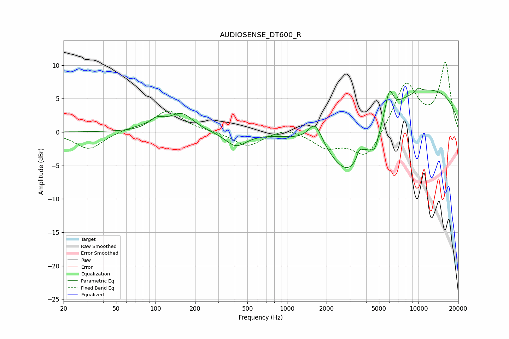

# AUDIOSENSE_DT600_R
See [usage instructions](https://github.com/jaakkopasanen/AutoEq#usage) for more options and info.

### Parametric EQs
Apply preamp of -6.7 dB when using parametric equalizer.

|   # | Type    |   Fc (Hz) |    Q |   Gain (dB) |
|-----|---------|-----------|------|-------------|
|   1 | Peaking |       101 | 2.41 |         1.5 |
|   2 | Peaking |       158 | 1.58 |         2.7 |
|   3 | Peaking |       409 | 1.79 |        -2.1 |
|   4 | Peaking |      1640 | 2.62 |         3.5 |
|   5 | Peaking |      3016 | 0.81 |        -9.5 |
|   6 | Peaking |      3567 | 6    |         1.6 |
|   7 | Peaking |      4675 | 4.43 |        -2.6 |
|   8 | Peaking |      5998 | 4.66 |         3.7 |
|   9 | Peaking |     10000 | 0.24 |         7   |
|  10 | Peaking |     10000 | 5.99 |         0.6 |

### Fixed Band EQs
When using fixed band (also called graphic) equalizer, apply preamp of **-10.5 dB** (if available) and set gains manually with these parameters.

|   # | Type    |   Fc (Hz) |    Q |   Gain (dB) |
|-----|---------|-----------|------|-------------|
|   1 | Peaking |        31 | 1.41 |        -2.6 |
|   2 | Peaking |        62 | 1.41 |         0.4 |
|   3 | Peaking |       125 | 1.41 |         3.2 |
|   4 | Peaking |       250 | 1.41 |         0.1 |
|   5 | Peaking |       500 | 1.41 |        -2.2 |
|   6 | Peaking |      1000 | 1.41 |         0.8 |
|   7 | Peaking |      2000 | 1.41 |        -2.2 |
|   8 | Peaking |      4000 | 1.41 |        -4.1 |
|   9 | Peaking |      8000 | 1.41 |         7.3 |
|  10 | Peaking |     16000 | 1.41 |        10.2 |

### Graphs

