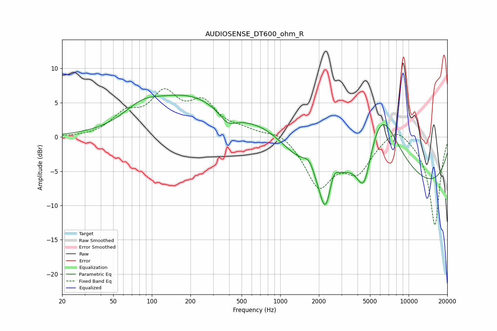

# AUDIOSENSE_DT600_ohm_R
See [usage instructions](https://github.com/jaakkopasanen/AutoEq#usage) for more options and info.

### Parametric EQs
Apply preamp of -6.2 dB when using parametric equalizer.

|   # | Type    |   Fc (Hz) |    Q |   Gain (dB) |
|-----|---------|-----------|------|-------------|
|   1 | Peaking |        84 | 0.96 |         2.4 |
|   2 | Peaking |       200 | 0.48 |         5.6 |
|   3 | Peaking |       391 | 2.22 |        -1.7 |
|   4 | Peaking |       801 | 0.71 |         3.4 |
|   5 | Peaking |      1676 | 3.11 |         1.8 |
|   6 | Peaking |      2253 | 2.78 |        -7   |
|   7 | Peaking |      2591 | 3.88 |         2.7 |
|   8 | Peaking |      4501 | 2.4  |        -6.7 |
|   9 | Peaking |      6056 | 0.59 |        19.2 |
|  10 | Peaking |      6342 | 0.18 |       -15.7 |

### Fixed Band EQs
When using fixed band (also called graphic) equalizer, apply preamp of **-7.1 dB** (if available) and set gains manually with these parameters.

|   # | Type    |   Fc (Hz) |    Q |   Gain (dB) |
|-----|---------|-----------|------|-------------|
|   1 | Peaking |        31 | 1.41 |        -0.1 |
|   2 | Peaking |        62 | 1.41 |         2.9 |
|   3 | Peaking |       125 | 1.41 |         5.7 |
|   4 | Peaking |       250 | 1.41 |         4.4 |
|   5 | Peaking |       500 | 1.41 |         0.8 |
|   6 | Peaking |      1000 | 1.41 |         1.1 |
|   7 | Peaking |      2000 | 1.41 |        -7   |
|   8 | Peaking |      4000 | 1.41 |        -4.5 |
|   9 | Peaking |      8000 | 1.41 |         2.1 |
|  10 | Peaking |     16000 | 1.41 |       -13   |

### Graphs

