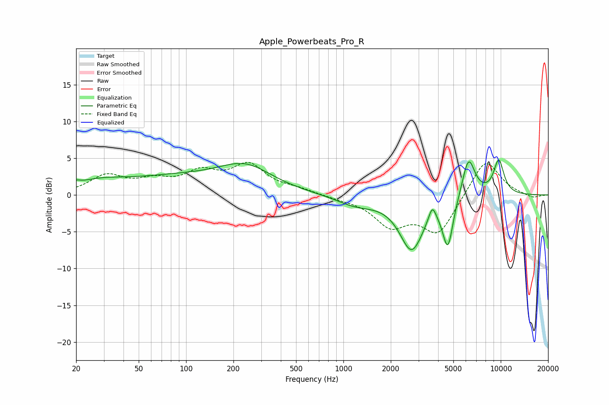

# Apple_Powerbeats_Pro_R
See [usage instructions](https://github.com/jaakkopasanen/AutoEq#usage) for more options and info.

### Parametric EQs
Apply preamp of -4.8 dB when using parametric equalizer.

|   # | Type    |   Fc (Hz) |    Q |   Gain (dB) |
|-----|---------|-----------|------|-------------|
|   1 | Peaking |        20 | 5.71 |         0.5 |
|   2 | Peaking |        27 | 0.86 |         1.3 |
|   3 | Peaking |        86 | 0.42 |         2.1 |
|   4 | Peaking |       240 | 0.83 |         3.2 |
|   5 | Peaking |      1198 | 1.14 |        -1.3 |
|   6 | Peaking |      2713 | 1.84 |        -7.2 |
|   7 | Peaking |      3672 | 5.99 |         2.1 |
|   8 | Peaking |      4613 | 4.14 |        -6.6 |
|   9 | Peaking |      6238 | 3.29 |         5.5 |
|  10 | Peaking |      9715 | 3.68 |         4.6 |

### Fixed Band EQs
When using fixed band (also called graphic) equalizer, apply preamp of **-4.5 dB** (if available) and set gains manually with these parameters.

|   # | Type    |   Fc (Hz) |    Q |   Gain (dB) |
|-----|---------|-----------|------|-------------|
|   1 | Peaking |        31 | 1.41 |         2.5 |
|   2 | Peaking |        62 | 1.41 |         1.6 |
|   3 | Peaking |       125 | 1.41 |         2.7 |
|   4 | Peaking |       250 | 1.41 |         3.8 |
|   5 | Peaking |       500 | 1.41 |         0.6 |
|   6 | Peaking |      1000 | 1.41 |        -0.4 |
|   7 | Peaking |      2000 | 1.41 |        -3.9 |
|   8 | Peaking |      4000 | 1.41 |        -5.1 |
|   9 | Peaking |      8000 | 1.41 |         5.1 |
|  10 | Peaking |     16000 | 1.41 |        -0.5 |

### Graphs

