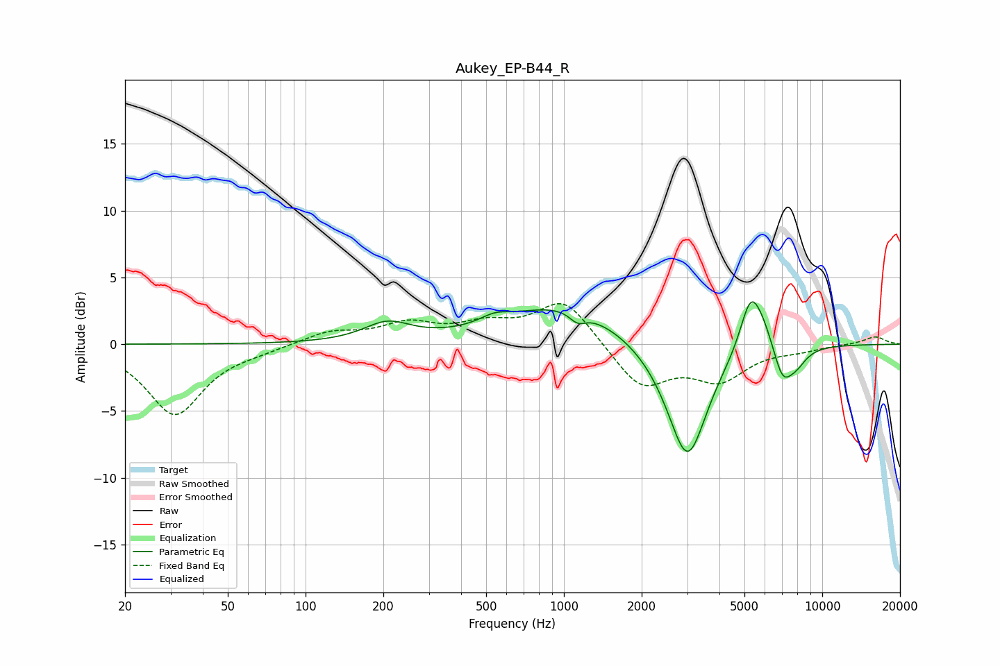

# Aukey_EP-B44_R
See [usage instructions](https://github.com/jaakkopasanen/AutoEq#usage) for more options and info.

### Parametric EQs
Apply preamp of -3.3 dB when using parametric equalizer.

|   # | Type    |   Fc (Hz) |    Q |   Gain (dB) |
|-----|---------|-----------|------|-------------|
|   1 | Peaking |       207 | 1.56 |         1.4 |
|   2 | Peaking |       539 | 2.49 |         0.6 |
|   3 | Peaking |      1000 | 0.62 |         3   |
|   4 | Peaking |      1130 | 4.42 |        -0.8 |
|   5 | Peaking |      2810 | 1.15 |        -1.2 |
|   6 | Peaking |      3014 | 1.92 |        -7.8 |
|   7 | Peaking |      5272 | 3.35 |         3.8 |
|   8 | Peaking |      5887 | 2.8  |         1.7 |
|   9 | Peaking |      7019 | 3.59 |        -2.5 |
|  10 | Peaking |      7935 | 3.17 |        -1.1 |

### Fixed Band EQs
When using fixed band (also called graphic) equalizer, apply preamp of **-3.1 dB** (if available) and set gains manually with these parameters.

|   # | Type    |   Fc (Hz) |    Q |   Gain (dB) |
|-----|---------|-----------|------|-------------|
|   1 | Peaking |        31 | 1.41 |        -5.2 |
|   2 | Peaking |        62 | 1.41 |        -0.3 |
|   3 | Peaking |       125 | 1.41 |         0.9 |
|   4 | Peaking |       250 | 1.41 |         1.4 |
|   5 | Peaking |       500 | 1.41 |         1.2 |
|   6 | Peaking |      1000 | 1.41 |         3.4 |
|   7 | Peaking |      2000 | 1.41 |        -3.2 |
|   8 | Peaking |      4000 | 1.41 |        -2.5 |
|   9 | Peaking |      8000 | 1.41 |        -0.3 |
|  10 | Peaking |     16000 | 1.41 |         0.6 |

### Graphs

