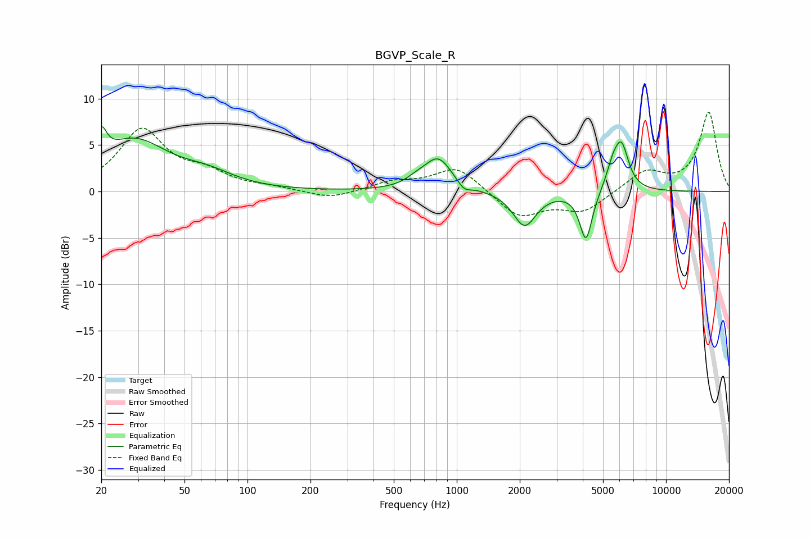

# BGVP_Scale_R
See [usage instructions](https://github.com/jaakkopasanen/AutoEq#usage) for more options and info.

### Parametric EQs
Apply preamp of -7.1 dB when using parametric equalizer.

|   # | Type    |   Fc (Hz) |    Q |   Gain (dB) |
|-----|---------|-----------|------|-------------|
|   1 | Peaking |        20 | 5.68 |         3   |
|   2 | Peaking |        29 | 0.86 |         5.3 |
|   3 | Peaking |        65 | 1.13 |         1.3 |
|   4 | Peaking |       640 | 2.79 |         0.6 |
|   5 | Peaking |       815 | 2.13 |         3.5 |
|   6 | Peaking |      1084 | 4.58 |        -0.8 |
|   7 | Peaking |      2110 | 2.59 |        -3.8 |
|   8 | Peaking |      4145 | 4.71 |        -5.4 |
|   9 | Peaking |      5573 | 4.31 |         2.1 |
|  10 | Peaking |      6134 | 4.07 |         4.5 |

### Fixed Band EQs
When using fixed band (also called graphic) equalizer, apply preamp of **-8.6 dB** (if available) and set gains manually with these parameters.

|   # | Type    |   Fc (Hz) |    Q |   Gain (dB) |
|-----|---------|-----------|------|-------------|
|   1 | Peaking |        31 | 1.41 |         6.5 |
|   2 | Peaking |        62 | 1.41 |         1.7 |
|   3 | Peaking |       125 | 1.41 |         0.3 |
|   4 | Peaking |       250 | 1.41 |        -0.9 |
|   5 | Peaking |       500 | 1.41 |         1   |
|   6 | Peaking |      1000 | 1.41 |         2.7 |
|   7 | Peaking |      2000 | 1.41 |        -2.8 |
|   8 | Peaking |      4000 | 1.41 |        -2.1 |
|   9 | Peaking |      8000 | 1.41 |         2.1 |
|  10 | Peaking |     16000 | 1.41 |         8.5 |

### Graphs

