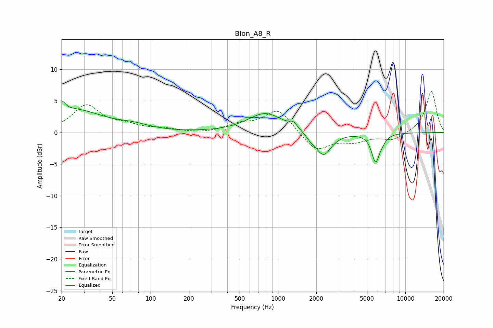

# Blon_A8_R
See [usage instructions](https://github.com/jaakkopasanen/AutoEq#usage) for more options and info.

### Parametric EQs
Apply preamp of -5.0 dB when using parametric equalizer.

|   # | Type    |   Fc (Hz) |    Q |   Gain (dB) |
|-----|---------|-----------|------|-------------|
|   1 | Peaking |        21 | 5.91 |         3.1 |
|   2 | Peaking |        21 | 5.98 |        -1.7 |
|   3 | Peaking |        24 | 0.6  |         3.6 |
|   4 | Peaking |        74 | 1.12 |         0.7 |
|   5 | Peaking |       799 | 1.03 |         3.1 |
|   6 | Peaking |      1322 | 4.77 |         0.9 |
|   7 | Peaking |      1810 | 4.19 |        -0.6 |
|   8 | Peaking |      2273 | 2.3  |        -3.7 |
|   9 | Peaking |      5837 | 4.37 |        -4.4 |
|  10 | Peaking |      6588 | 4.79 |        -0.6 |

### Fixed Band EQs
When using fixed band (also called graphic) equalizer, apply preamp of **-6.6 dB** (if available) and set gains manually with these parameters.

|   # | Type    |   Fc (Hz) |    Q |   Gain (dB) |
|-----|---------|-----------|------|-------------|
|   1 | Peaking |        31 | 1.41 |         4.2 |
|   2 | Peaking |        62 | 1.41 |         0.9 |
|   3 | Peaking |       125 | 1.41 |         0.5 |
|   4 | Peaking |       250 | 1.41 |        -0.2 |
|   5 | Peaking |       500 | 1.41 |         1.1 |
|   6 | Peaking |      1000 | 1.41 |         3.7 |
|   7 | Peaking |      2000 | 1.41 |        -3   |
|   8 | Peaking |      4000 | 1.41 |        -1.2 |
|   9 | Peaking |      8000 | 1.41 |        -1.2 |
|  10 | Peaking |     16000 | 1.41 |         6.6 |

### Graphs

