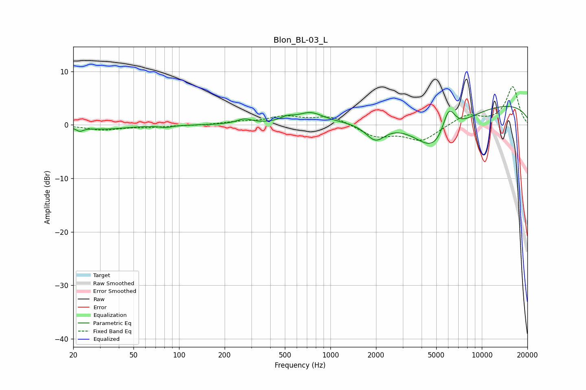

# Blon_BL-03_L
See [usage instructions](https://github.com/jaakkopasanen/AutoEq#usage) for more options and info.

### Parametric EQs
Apply preamp of -3.5 dB when using parametric equalizer.

|   # | Type    |   Fc (Hz) |    Q |   Gain (dB) |
|-----|---------|-----------|------|-------------|
|   1 | Peaking |        22 | 5.86 |        -0.7 |
|   2 | Peaking |        33 | 1    |        -0.7 |
|   3 | Peaking |        82 | 3.71 |        -0.4 |
|   4 | Peaking |       270 | 2.8  |         0.9 |
|   5 | Peaking |       516 | 3.07 |         0.8 |
|   6 | Peaking |       739 | 1.66 |         2   |
|   7 | Peaking |      1983 | 2.13 |        -3.4 |
|   8 | Peaking |      4990 | 0.91 |        -8.7 |
|   9 | Peaking |      6043 | 3.04 |         5.8 |
|  10 | Peaking |      9533 | 0.18 |         4.3 |

### Fixed Band EQs
When using fixed band (also called graphic) equalizer, apply preamp of **-7.2 dB** (if available) and set gains manually with these parameters.

|   # | Type    |   Fc (Hz) |    Q |   Gain (dB) |
|-----|---------|-----------|------|-------------|
|   1 | Peaking |        31 | 1.41 |        -0.9 |
|   2 | Peaking |        62 | 1.41 |        -0.4 |
|   3 | Peaking |       125 | 1.41 |        -0.1 |
|   4 | Peaking |       250 | 1.41 |         0.5 |
|   5 | Peaking |       500 | 1.41 |         1.4 |
|   6 | Peaking |      1000 | 1.41 |         1.6 |
|   7 | Peaking |      2000 | 1.41 |        -2.1 |
|   8 | Peaking |      4000 | 1.41 |        -2.9 |
|   9 | Peaking |      8000 | 1.41 |         1.9 |
|  10 | Peaking |     16000 | 1.41 |         7.1 |

### Graphs

