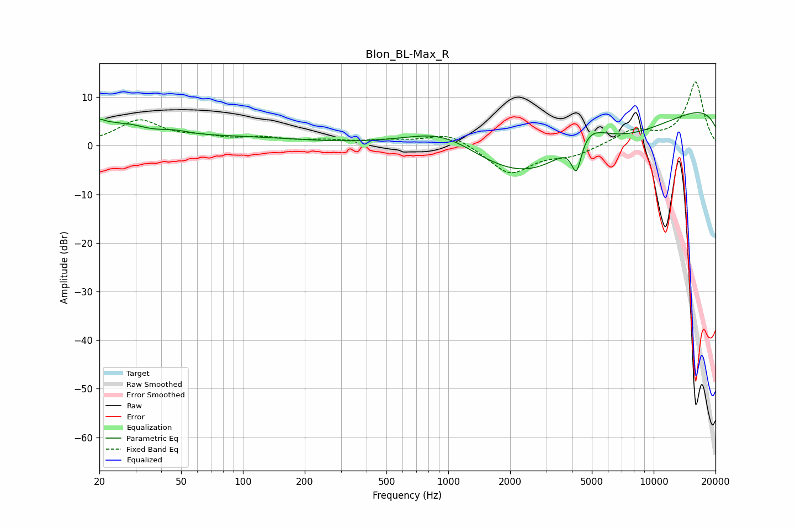

# Blon_BL-Max_R
See [usage instructions](https://github.com/jaakkopasanen/AutoEq#usage) for more options and info.

### Parametric EQs
Apply preamp of -6.9 dB when using parametric equalizer.

|   # | Type    |   Fc (Hz) |    Q |   Gain (dB) |
|-----|---------|-----------|------|-------------|
|   1 | Peaking |        20 | 5.22 |         1.9 |
|   2 | Peaking |        25 | 1.33 |         3.9 |
|   3 | Peaking |        26 | 5.01 |        -0.4 |
|   4 | Peaking |        46 | 1.92 |         0.9 |
|   5 | Peaking |       178 | 0.2  |         2.4 |
|   6 | Peaking |       963 | 0.47 |        13.1 |
|   7 | Peaking |      2400 | 0.21 |       -20   |
|   8 | Peaking |      4210 | 5.44 |        -7.4 |
|   9 | Peaking |      4648 | 1.25 |         7.5 |
|  10 | Peaking |     10000 | 0.18 |        12.3 |

### Fixed Band EQs
When using fixed band (also called graphic) equalizer, apply preamp of **-13.2 dB** (if available) and set gains manually with these parameters.

|   # | Type    |   Fc (Hz) |    Q |   Gain (dB) |
|-----|---------|-----------|------|-------------|
|   1 | Peaking |        31 | 1.41 |         5   |
|   2 | Peaking |        62 | 1.41 |         1.3 |
|   3 | Peaking |       125 | 1.41 |         1.3 |
|   4 | Peaking |       250 | 1.41 |         0.8 |
|   5 | Peaking |       500 | 1.41 |         0.9 |
|   6 | Peaking |      1000 | 1.41 |         2.7 |
|   7 | Peaking |      2000 | 1.41 |        -5.9 |
|   8 | Peaking |      4000 | 1.41 |        -1.9 |
|   9 | Peaking |      8000 | 1.41 |         2.9 |
|  10 | Peaking |     16000 | 1.41 |        13.1 |

### Graphs

